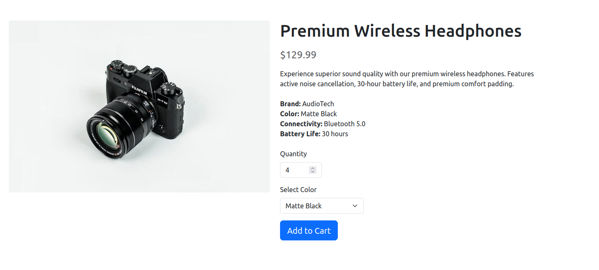

# TP 3 - Les formulaires en Symfony

## But du TP  

Le but de ce TP est de construire le formulaire suivant en Symfony. 



### Etape 1

Le code html de la page est le suivant : 


* Importer Bootstrap 5.3 

    ```<link href="https://cdn.jsdelivr.net/npm/bootstrap@5.3.2/dist/css/bootstrap.min.css" rel="stylesheet">```

* Votre page doit contenir ce code : 
    ```html
    <!-- Product Page HTML -->
    <div class="container my-5">
    <div class="row">
        <div class="col-md-6">
        
        </div>
        
        <div class="col-md-6">
        <h1 class="mb-3">Premium Wireless Headphones</h1>
        <p class="text-muted fs-4 mb-3">$129.99</p>
        
        <p class="mb-4">
            Experience superior sound quality with our premium wireless headphones. 
            Features active noise cancellation, 30-hour battery life, and premium comfort padding.
        </p>
        
        <ul class="list-unstyled mb-4">
            <li><strong>Brand:</strong> AudioTech</li>
            <li><strong>Color:</strong> Matte Black</li>
            <li><strong>Connectivity:</strong> Bluetooth 5.0</li>
            <li><strong>Battery Life:</strong> 30 hours</li>
        </ul>
        
        <form method="post" action="/cart">
            <div class="mb-3">
            <label for="quantity" class="form-label">Quantity</label>
            <input type="number" class="form-control" id="quantity" name="quantity" value="1" min="1" max="10" style="max-width: 100px;">
            </div>
            
            <div class="mb-3">
            <label for="color" class="form-label">Select Color</label>
            <select class="form-select" id="color" name="color" style="max-width: 200px;">
                <option value="black">Matte Black</option>
                <option value="white">Pearl White</option>
                <option value="silver">Silver</option>
            </select>
            </div>
            
            <button type="submit" class="btn btn-primary btn-lg">Add to Cart</button>
        </form>
        </div>
    </div>
    </div>

    ```

### Etape 2

* Transformer ce code HTML en Symfony en utilisant les techniques de personnalisation via Twig, création des formulaires avec des Form Types.

### Etape 3: 

* Vous devez rendre ce travail avant 28/12/2025. Mettez-le dans un  repo Github
* Votre repo doit contenir un fichier `readme.md` contenant un rapport rapide de ce que vous avez fait dans votre code
* Envoyer votre lien par mail à `khadiri.issam@hotmail.com` avec comme sujet `<Nom Etudiant>  / TP 3  - EHEI 2025/2026`
* Tout email ne respectant pas ces consignes ne sera pas accepté