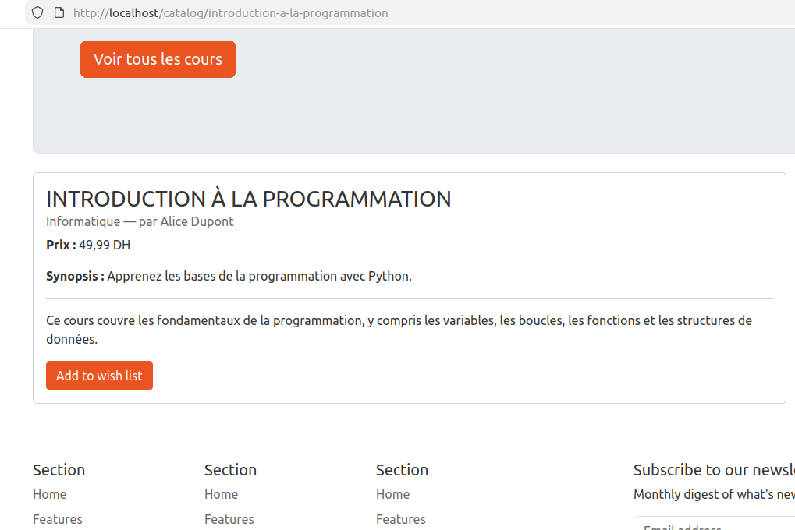
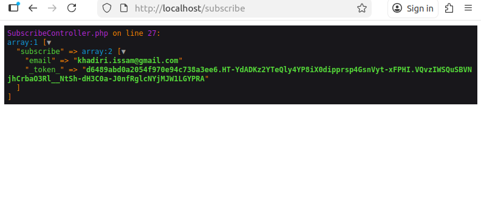

# TP 3 - Les formulaires en Symfony

## But du TP  

Préparer le terrain pour intégrer les formulaires dans notre site vitrine de cours.

### Exercice 1 : Ajouter un cours à la wishlist
 
Ajouter un bouton pour ajouter un cours à liste des souhaits. Pour cela :

- Créer un formulaire dans la page de détails d'un cours: `src/Form/Type/AddToWishlistType.php` : 

    ```php
    <?php

    declare(strict_types=1);

    namespace App\Form\Type;

    use Symfony\Component\Form\AbstractType;
    use Symfony\Component\OptionsResolver\OptionsResolver;

    class AddToWishlistType extends AbstractType
    {
        public function configureOptions(OptionsResolver $resolver): void
        {
            $resolver->setDefaults([
                // this is duplication: csrf is enabled by default @see config/packages/csrf.yaml:4
                'csrf_protection' => true, // Ensure to protect this form against the csrf attack
                'csrf_token_id' => 'add_to_wishlist',
                'csrf_field_name' => '__token',
            ]);
        }
    }


    ```

- Afficher le formulaire : `templates/catalog/show.html.twig`

    ```twig
        
        
            {{ include('partials/_jumborton.html.twig') }}
            <div class="row">
                <div class="col-9">
                    <div class="card mb-4">
                        <div class="card-body">
                            <h3 class="card-title">{{ course.name | upper }}</h3>
                            <h6 class="card-subtitle mb-2 text-muted">
                                {{ course.category.name }} — par {{ course.author.name }}
                            </h6>
                            <p class="card-text"><strong>Prix :</strong>
                                
                                    {{ course.price | number_format(2,',', ' ') }} DH
                                
                                    Gratuit
                                
                            </p>
                            <p class="card-text"><strong>Synopsis :</strong> {{ course.synopsis }}</p>
                            <hr>
                            <p class="card-text">{{ course.description }}</p>
                            {{ form_start(form) }}
                            <button type="submit" class="btn btn-primary">
                                Add to wish list
                            </button>
                            {{ form_end(form) }}
                        </div>
                    </div>
                </div>
                <div class="col-3">
                    {{ render(controller('App\\Controller\\CatalogController::similarCourses')) }}
                </div>
            </div>

        

    ```

- Vous devez avoir ce rendu : 

    


### Exercice 2 : Afficher et dynamiser le formulaire de souscription


Nous sommes d’accord que ce formulaire est affiché sur l’ensemble du site puisqu’il est inclus dans `templates/layout.twig`.

Ainsi, les étapes à suivre sont :

- Créer le formulaire avec Symfony.

- S’assurer que le formulaire s’affiche sur toutes les pages.

- Lors de la soumission, le formulaire doit être envoyé vers une route unique.


Nous allons donc avoir besoin de

1) Créer un form type représentant le formulaire de souscription : `src/Form/Type/SubscribeType.php`

    ```php
    <?php

    declare(strict_types=1);

    namespace App\Form\Type;

    use Symfony\Component\Form\AbstractType;
    use Symfony\Component\Form\Extension\Core\Type\EmailType;
    use Symfony\Component\Form\FormBuilderInterface;

    class SubscribeType extends AbstractType
    {
        public function buildForm(FormBuilderInterface $builder, array $options): void
        {
            $builder->add(child: 'email', type: EmailType::class);
        }
    }

    public function configureOptions(OptionsResolver $resolver): void
    {
        $resolver->setDefaults(defaults: [
            // this is a duplication to explain that you can enable/disable csrf protection on the type.
            'csrf_protection' => true, // this is not necessary. @see config/packages/csrf.yaml:4
            
            'csrf_token_id' => '__subscribe_form',
            'csrf_field_name' => '_token_'
        ]);
    }

    ```

2) Comme notre formulaire sera affiché sur l’ensemble du site, il n’est pas pratique de le construire et de l’afficher dans **toutes** les routes et **tous** les contrôleurs. Nous allons donc utiliser la technique d’affichage d’un contrôleur dans Twig. L’idée est de créer le formulaire et de l’afficher via un contrôleur, puis d’appeler ce dernier avec `render(controller(...))`.

    Créons un contrôleur `src/Controller/SubscribeController.php`

    ```php
    <?php

    declare(strict_types=1);

    namespace App\Controller;

    use App\Form\Type\SubscribeType;
    use Symfony\Bundle\FrameworkBundle\Controller\AbstractController;
    use Symfony\Component\HttpFoundation\Request;
    use Symfony\Component\HttpFoundation\Response;
    use Symfony\Component\Routing\Attribute\Route;

    class SubscribeController extends AbstractController
    {
        public function showForm(): Response
        {
            $form = $this->createForm(SubscribeType::class);

            return $this->render(
                'subscribe/index.html.twig',
                ['form' => $form]
            );
        }

        #[Route(path: '/subscribe', name: 'app_subscribe')]
        public function proceed(Request $request): Response
        {
            dd($request->getPayload()->all(),);
        }
    }

    ```

    La methode `showForm` permet de construire le formulaire puis l'envoit  la template `subscribe/index.html.twig`. 

    La template `templates/subscribe/index.html.twig` ressemblera à 

    ```twig 
        {{ form_start(form, {action: url('app_subscribe') }) }}
        <h5>Subscribe to our newsletter</h5>
        <p>Monthly digest of what's new and exciting from us.</p>
        <div class="d-flex flex-column flex-sm-row w-100 gap-2">
            {{ form_label(form.email, 'Email address', {label_attr: {class: 'visually-hidden'}}) }}
            {{ form_widget(
                form.email,
                {attr: {class: 'form-control', placeholder: 'Email address'}}
            ) }}
            <button class="btn btn-primary" type="button">Subscribe</button>
            {{ form_errors(form) }}
        </div>
    {{ form_end(form) }}

    ```

    ici vous remarquez que nous avons: 
    
    - Afficher le formulaire comme vu dans le cours (la vidéo)

    - Changer l'action par défaut en générant une URL (avec `url()`) pour la route `app_subscribe`

    - Oui : On peut même changer l'action et envoyer le formulaire vers une autre route

    **NOTE** : Par défaut, Symfony recommande d’envoyer le formulaire vers le même contrôleur que celui qui l’a affiché. Je souhaite simplement vous montrer qu’il est possible de modifier cette destination, rien de plus.


    La route `/subscribe` est notre route à laquelle nous allons envoyer les informations de notre formulaire pour les traiter. 

    Dans la template `templates/layout.html.twig`, nous pouvons afficher le formulaire en appelant le contrôleur `showForm`

    Remplacer le code suivant 

    ```twig
        <div class="col-md-5 offset-md-1 mb-3">
            <form>
                <h5>Subscribe to our newsletter</h5>
                <p>Monthly digest of what's new and exciting from us.</p>
                <div class="d-flex flex-column flex-sm-row w-100 gap-2">
                    <label for="newsletter1" class="visually-hidden">
                        Email address
                    </label>
                    <input id="newsletter1" type="email" class="form-control" placeholder="Email address" />
                    <button class="btn btn-primary" type="button">Subscribe</button>
                </div>
            </form>
        </div>
    ```

    par 

    ```twig
        <div class="col-md-5 offset-md-1 mb-3">
            {{ render(controller('App\\Controller\\SubscribeController::showForm')) }}
        </div>
    ```

    Soumettez votre formulaire, vous devez avoir un résultat qui ressemble à 

    