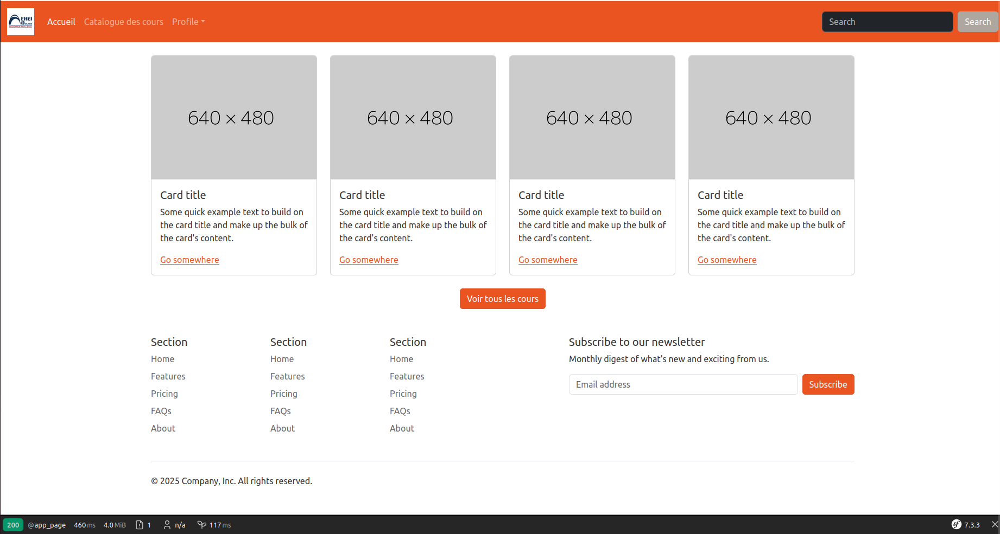

# Enoncé 001

Le but de cette première partie du TP est de concevoir un site statique.

## Préparation

Nous allons utiliser Bootstrap comme framework. Nous nous baserons sur le thème [United](https://bootswatch.com/united/) proposé par Bootswatch. Ce site fournit des composants prêts à copier-coller afin de simplifier la réalisation du TP.

Vous pouvez télécharger le fichier CSS de ce thème ou simplement utiliser le fichier local  [bootstrap.min.css](./bootstrap.min.css).

## Structure principale

Nous souhaitons avoir la structure suivante : 



En general, la page doit avoir un HEADER, un FOOTER et un contenu (peu importe)

### But de ce TP 

Concevoir un Site e-learning : une vitrine permettant d'exposer une variété des cours en ligne.

- Un HEADER : contenant des liens pour d'autres pages

- BODY : Une liste de cours dans la page d'accueil, avec pour chaque cours, un lien pour lire le cours. 

un bouton permettant à l'utilisateur de voir tous les cours 

- FOOTER: une liste de liens (liens utils, formulaire d'inscription à la newsletter...)

Allons-y : 

### 1- Créer une template principale pour le site: 

Créons tout d'abord un template principal : `templates/layout.html.twig`. Ce fichier servira de modèle pour toutes les pages web de notre site. Chaque page devra comporter un en-tête (HEADER), un pied de page (FOOTER) et une section de contenu (CONTENT).

Placez le code suivant dans le fichier `templates/layout.html.twig` :

```twig


    <nav class="navbar navbar-expand-lg bg-primary" data-bs-theme="dark">
        <div class="container-fluid">
            <a class="navbar-brand" href="#">
                
            </a>
            <button class="navbar-toggler" type="button" data-bs-toggle="collapse" data-bs-target="#navbarColor01" aria-controls="navbarColor01" aria-expanded="false" aria-label="Toggle navigation">
                <span class="navbar-toggler-icon"></span>
            </button>
            <div class="collapse navbar-collapse" id="navbarColor01">
                <ul class="navbar-nav me-auto">
                    <li class="nav-item">
                        <a class="nav-link active" href="#">Accueil
                            <span class="visually-hidden">(current)</span>
                        </a>
                    </li>
                    <li class="nav-item">
                        <a class="nav-link" href="#">Catalogue des cours</a>
                    </li>
                    <li class="nav-item dropdown">
                        <a class="nav-link dropdown-toggle" data-bs-toggle="dropdown" href="#" role="button" aria-haspopup="true" aria-expanded="false">Profile</a>
                        <div class="dropdown-menu">
                            
                                <a class="dropdown-item" href="#">Profil</a>
                                <div class="dropdown-divider"></div>
                                <a class="dropdown-item" href="#">Se deconnecter</a>
                            
                                <a class="dropdown-item" href="#">Se connecter</a>
                            
                        </div>
                    </li>
                </ul>
                <form class="d-flex">
                    <input class="form-control me-sm-2" type="search" placeholder="Search">
                    <button class="btn btn-secondary my-2 my-sm-0" type="submit">Search</button>
                </form>
            </div>
        </div>
    </nav>
    <div class="container">
        
    </div>
    <div class="container">
        <footer class="py-5">
            <div class="row">
                <div class="col-6 col-md-2 mb-3"><h5>Section</h5>
                    <ul class="nav flex-column">
                        <li class="nav-item mb-2"><a href="#" class="nav-link p-0 text-body-secondary">Home</a></li>
                        <li class="nav-item mb-2"><a href="#" class="nav-link p-0 text-body-secondary">Features</a></li>
                        <li class="nav-item mb-2"><a href="#" class="nav-link p-0 text-body-secondary">Pricing</a></li>
                        <li class="nav-item mb-2"><a href="#" class="nav-link p-0 text-body-secondary">FAQs</a></li>
                        <li class="nav-item mb-2"><a href="#" class="nav-link p-0 text-body-secondary">About</a></li>
                    </ul>
                </div>
                <div class="col-6 col-md-2 mb-3"><h5>Section</h5>
                    <ul class="nav flex-column">
                        <li class="nav-item mb-2"><a href="#" class="nav-link p-0 text-body-secondary">Home</a></li>
                        <li class="nav-item mb-2"><a href="#" class="nav-link p-0 text-body-secondary">Features</a></li>
                        <li class="nav-item mb-2"><a href="#" class="nav-link p-0 text-body-secondary">Pricing</a></li>
                        <li class="nav-item mb-2"><a href="#" class="nav-link p-0 text-body-secondary">FAQs</a></li>
                        <li class="nav-item mb-2"><a href="#" class="nav-link p-0 text-body-secondary">About</a></li>
                    </ul>
                </div>
                <div class="col-6 col-md-2 mb-3"><h5>Section</h5>
                    <ul class="nav flex-column">
                        <li class="nav-item mb-2"><a href="#" class="nav-link p-0 text-body-secondary">Home</a></li>
                        <li class="nav-item mb-2"><a href="#" class="nav-link p-0 text-body-secondary">Features</a></li>
                        <li class="nav-item mb-2"><a href="#" class="nav-link p-0 text-body-secondary">Pricing</a></li>
                        <li class="nav-item mb-2"><a href="#" class="nav-link p-0 text-body-secondary">FAQs</a></li>
                        <li class="nav-item mb-2"><a href="#" class="nav-link p-0 text-body-secondary">About</a></li>
                    </ul>
                </div>
                <div class="col-md-5 offset-md-1 mb-3">
                    <form>
                        <h5>Subscribe to our newsletter</h5>
                        <p>Monthly digest of what's new and exciting from us.</p>
                        <div class="d-flex flex-column flex-sm-row w-100 gap-2">
                            <label for="newsletter1" class="visually-hidden">
                                Email address
                            </label>
                            <input id="newsletter1" type="email" class="form-control" placeholder="Email address" />
                            <button class="btn btn-primary" type="button">Subscribe</button>
                        </div>
                    </form>
                </div>
            </div>
            <div class="d-flex flex-column flex-sm-row justify-content-between py-4 my-4 border-top">
                <p>© 2025 Company, Inc. All rights reserved.</p>
                <ul class="list-unstyled d-flex">
                    <li class="ms-3">
                        <a class="link-body-emphasis" href="#" aria-label="Instagram">
                            <svg class="bi" width="24" height="24">
                                <use xlink:href="#instagram"></use>
                            </svg>
                        </a>
                    </li>
                    <li class="ms-3">
                        <a class="link-body-emphasis" href="#" aria-label="Facebook">
                            <svg class="bi" width="24" height="24" aria-hidden="true">
                                <use xlink:href="#facebook"></use>
                            </svg>
                        </a>
                    </li>
                </ul>
            </div>
        </footer>
    </div>


    <link rel="stylesheet" href="{{ asset('css/bootstrap.min.css') }}"/>


{{ parent() }}
<script src="https://cdnjs.cloudflare.com/ajax/libs/bootstrap/5.3.8/js/bootstrap.min.js"
   integrity="sha512-nKXmKvJyiGQy343jatQlzDprflyB5c+tKCzGP3Uq67v+lmzfnZUi/ZT+fc6ITZfSC5HhaBKUIvr/nTLCV+7F+Q=="
   crossorigin="anonymous"
   referrerpolicy="no-referrer">
</script>
<script src="https://cdnjs.cloudflare.com/ajax/libs/bootstrap/5.3.8/js/bootstrap.bundle.min.js"
   integrity="sha512-HvOjJrdwNpDbkGJIG2ZNqDlVqMo77qbs4Me4cah0HoDrfhrbA+8SBlZn1KrvAQw7cILLPFJvdwIgphzQmMm+Pw=="
   crossorigin="anonymous"
   referrerpolicy="no-referrer">
</script>


```

Dans ce code nous : 

- Nous utilisons `{{ asset(...) }}` pour inclure des ressources telles que des images ou des fichiers CSS (appelés assets). Exemple : `<link rel="stylesheet" href="{{ asset('css/bootstrap.min.css') }}" />`

- Le menu **Profil** permet d’afficher différents éléments en fonction de l’état de connexion de l’utilisateur :
    - Si l’utilisateur est connecté, certains menus sont visibles.
    - Sinon, seul le lien de connexion est affiché.

### 2- Créer la page d'accueil 

Créez un contrôleur dans `src/Controller/PageController.php` et ajoutez-y le contenu suivant :

```php
<?php

namespace App\Controller;

use Symfony\Bundle\FrameworkBundle\Controller\AbstractController;
use Symfony\Component\HttpFoundation\Response;
use Symfony\Component\Routing\Attribute\Route;

final class PageController extends AbstractController
{
    #[Route('/page', name: 'app_page')]
    public function index(): Response
    {
        return $this->render('page/index.html.twig', [
            'controller_name' => 'PageController',
        ]);
    }
}
```

Nous construisons ici la page d’accueil, accessible via [/page](http://localhost/page). Si vous souhaitez que votre contrôleur soit accessible directement à la racine, c’est-à-dire via [/](http://localhost/), il suffit de supprimer "page" dans l’attribut `#[Route]`

### 3- Créer la template page/index.html.twig

Ce template contient le contenu de la page principale : la liste des cours, ainsi qu’un lien vers cette liste.

```twig


    <div class="row mt-4">
        
            <div class="col-3">
                <div class="card">
                    
                    <div class="card-body">
                        <h5 class="card-title">Card title</h5>
                        <p class="card-text">
                            Some quick example text to build on the card title and make up the bulk of the
                            card's content.
                        </p>
                        <a href="#">Go somewhere</a>
                    </div>
                </div>
            </div>
        
    </div>
    <div class="row justify-content-center mt-4">
        <div class="col-auto">
            <a href class="btn btn-primary">Voir tous les cours</a>
        </div>
    </div>

```

- le template `templates/page/index.html.twig` étend du template `templates/layout.html.twig` et pas directement de `base.html.twig`
- Simulons le parcours du tableau des cours. 

```twig

    <div class="col-3">
        <div class="card">
            
            <div class="card-body">
                <h5 class="card-title">Card title</h5>
                <p class="card-text">
                    Some quick example text to build on the card title and make up the bulk of the
                    card's content.
                </p>
                <a href="#">Go somewhere</a>
            </div>
        </div>
    </div>

```

ici nous allons afficher 4 cours. 

### 4- Lier les pages

Supposons maintenant que nous souhaitons rediriger l’utilisateur vers le formulaire de connexion lorsqu’il clique sur le bouton **Se connecter**.

Pour cela, créons un controleur `src/Controller/SecurityController.php`

```php
<?php

declare(strict_types=1);

namespace App\Controller;

use Symfony\Bundle\FrameworkBundle\Controller\AbstractController;
use Symfony\Component\HttpFoundation\Response;
use Symfony\Component\Routing\Attribute\Route;

class SecurityController extends AbstractController
{
    #[Route(name: 'app_security', path: '/security')]
    public function index(): Response
    {
        return $this->render('security/index.html.twig');
    }
}
```

Ensuite, créons la template `templates/security/index.html.twig`, et mettre ce code : 

```twig 


<form>
    <fieldset class="mb-4">
        <div>
            <label for="email" class="form-label mt-4">Email address</label>
            <input type="email" class="form-control" id="email" placeholder="Enter email">
            <small id="emailHelp" class="form-text text-muted">We'll never share your email with anyone else.</small>
        </div>
        <div>
            <label for="password" class="form-label mt-4">Password</label>
            <input type="password" class="form-control" id="password" placeholder="Password" autocomplete="off">
        </div>
    </fieldset>
    <button type="button" class="btn btn-primary">Primary</button> <a href="">Mot de passe oublié</a>
</form>

```

- Pour créer des liens entre les pages, nous pouvons utiliser les fonctions `path()` et `url()`. Mais quelle est la différence entre ces deux fonctions ?

  - **path()** : génère une URL relative, par exemple : /contact, /profil

  - **url()** : génère une URL absolue, par exemple : http://localhost/contact, https://monsite.fr/profil

- Remarques :

    - **path()** → chemin relatif, recommandé pour les liens internes au site.

    - **url()** → chemin absolu, incluant le protocole et le nom de domaine (utile pour les e-mails ou les redirections externes).

Dans `templates/layout.html.twig`, change la ligne 29 comme ceci: 

```twig
    ...
    
        <a class="dropdown-item" href="#">Profil</a>
        <div class="dropdown-divider"></div>
        <a class="dropdown-item" href="#">Se deconnecter</a>
    
        <a class="dropdown-item" href="{{ url('app_security') }}">Se connecter</a>
    

    ...
```

Vous pouvez vous amuser à changer **url()** par **path()** et voir la différence. 

### 5- Simulons une page détails d'un cours 

Pour avoir un cas plus réaliste, nous aurons besoins de quelques DTOs

- `src/DTO/Course.php` : 
```php
<?php

namespace App\DTO;

class Course
{
    public function __construct(
        private string $name,
        private float $price,
        private string $synopsis,
        private string $description,
        private Author $author,
        private Category $category,
    ) {
    }

    public function getName(): string
    {
        return $this->name;
    }

    public function getPrice(): float
    {
        return $this->price;
    }

    public function getSynopsis(): string
    {
        return $this->synopsis;
    }

    public function getDescription(): string
    {
        return $this->description;
    }

    public function getAuthor(): Author
    {
        return $this->author;
    }

    public function getCategory(): Category
    {
        return $this->category;
    }


}
```

- `src/DTO/Author.php`
```
<?php

namespace App\DTO;

class Author
{
    public function __construct(
        private string $name,
    ) {
    }

    public function getName(): string
    {
        return $this->name;
    }
}
```

- `src/DTO/Category.php` 
```
<?php

namespace App\DTO;

class Category
{
    public function __construct(
        private string $name,
    ) {
    }

    public function getName(): string
    {
        return $this->name;
    }
}
```

Créons maintenant un contrôleur chargé de gérer les cours : `src/Controller/CatalogController.php`, puis ajoutons le code suivant: 

```php
<?php

declare(strict_types=1);

namespace App\Controller;

use App\DTO\Author;
use App\DTO\Category;
use App\DTO\Course;
use Symfony\Bundle\FrameworkBundle\Controller\AbstractController;
use Symfony\Component\HttpFoundation\Response;
use Symfony\Component\Routing\Attribute\Route;

#[Route(path: '/catalog', name: 'app_catalog_')]
class CatalogController extends AbstractController
{
    #[Route(path: '/{slug}', name: 'view')]
    public function show(string $slug): Response
    {
        $course = $this->loadCourse($slug); // simulate loading this course from the storge (from API or Database)

        if (null === $course) {
            throw $this->createNotFoundException('La page que vous demandez est introuvable.');
        }

        return $this->render('catalog/show.html.twig', [
            'course' => $course,
        ]);
    }

    #[Route(path: '/all', name: 'all', priority: 1)]
    public function all(): Response
    {
        $courses = $this->findAll(); // simulate loading this course from the storge (from API or Database)

        return $this->render('catalog/index.html.twig', [
            'courses' => $courses,
        ]);
    }

    /**
     * This function simulates **Querying course from a storage - e.h database**
     *
     * @param string $slug
     *
     * @return ?Course
     */
    private function loadCourse(string $slug): Course|null
    {
        $course = $this->findAll();

        return $course[$slug] ?? null;
    }

    private function findAll(): array
    {
        return [
            'introduction-a-la-programmation' => new Course(
                name: 'Introduction à la programmation',
                price: 49.99,
                synopsis: 'Apprenez les bases de la programmation avec Python.',
                description: 'Ce cours couvre les fondamentaux de la programmation, y compris les variables, les boucles, les fonctions et les structures de données.',
                author: new Author('Alice Dupont'),
                category: new Category('Informatique')
            ),
            'analyse-financiere' => new Course(
                name: 'Analyse financière',
                price: 79.00,
                synopsis: 'Comprendre les états financiers et les indicateurs clés.',
                description: 'Ce cours vous guide à travers l’analyse des bilans, des comptes de résultat et des flux de trésorerie.',
                author: new Author('Jean Martin'),
                category: new Category('Finance')
            ),
            'photographie-numerique' => new Course(
                name: 'Photographie numérique',
                price: 59.50,
                synopsis: 'Maîtrisez votre appareil photo et composez des images percutantes.',
                description: 'Apprenez les techniques de prise de vue, de composition, et de retouche photo avec des outils professionnels.',
                author: new Author('Sophie Bernard'),
                category: new Category('Arts visuels')
            )
        ];
    }
}
```

Commentaires: 

- La fonction `findAll()` simule la récupération de tous les cours depuis la base de données ou depuis une API.

- La fonction `loadCourse(string $slug)` simule la récupération d’un cours en se basant sur son slug, sans utiliser l’ID.

- Nous disposons de deux routes similaires : `/catalog/{slug}` et `/catalog/all`, qui simulent respectivement l’affichage des détails d’un cours et la consultation du catalogue complet.

- Nous avons utilisé l’option `priority` afin de privilégier la route `/catalog/all` lorsque l’utilisateur souhaite voir le catalogue, et non un cours dont le slug serait égal à `"all"`.

- Nous souhaitons que **toutes** les routes de ce contrôleur soient préfixées par `/catalog`, et que leurs noms soient préfixés par `app_catalog_`. Pour cela, nous avons placé l’attribut `#[Route]`

```php
...
#[Route(path: '/catalog', name: 'app_catalog_')]
class CatalogController extends AbstractController
{
    ...
}
```

- Pour tester ces routes : [http://localhost/catalog/all](http://localhost/catalog/all) pour voir le catalog. [http://localhost/catalog/introduction-a-la-programmation](http://localhost/catalog/introduction-a-la-programmation) pour voir un cours précis.

- Si l’utilisateur demande un cours qui n’existe pas, une erreur 404 est affichée grâce à :

```php
if (null === $course) {
    throw $this->createNotFoundException('La page que vous demandez est introuvable.');
}
```

#### Nos templates : 

Maintenant que notre contrôleur est prêt, commençons à développer nos templates: 

- dans `templates/catalog/show.html.twig` mettre le code suivant 

```twig


    <div class="p-5 mb-4 mt-4 bg-light rounded-3 border">
        <div class="container-fluid py-5">
            <h1 class="display-5 fw-bold">Bienvenue dans le catalogue des cours</h1>
            <p class="col-md-8 fs-4">
                Explorez nos formations en ligne, conçues par des experts pour vous aider à progresser.
            </p>
            <a href="{{ path('app_catalog_all') }}" class="btn btn-primary btn-lg">Voir tous les cours</a>
        </div>
    </div>

    <div class="row">
        <div class="col-9">
            <div class="card mb-4">
                <div class="card-body">
                    <h3 class="card-title">{{ course.name | upper }}</h3>
                    <h6 class="card-subtitle mb-2 text-muted">
                        {{ course.category.name }} — par {{ course.author.name }}
                    </h6>
                    <p class="card-text"><strong>Prix :</strong>
                        
                            {{ course.price | number_format(2,',', ' ') }} DH
                        
                            Gratuit
                        
                    </p>
                    <p class="card-text"><strong>Synopsis :</strong> {{ course.synopsis }}</p>
                    <hr>
                    <p class="card-text">{{ course.description }}</p>
                </div>
            </div>
        </div>
        <div class="col-3">
            Liste des cours similaires...
        </div>
    </div>


```

Commentaires: 

- Nous affichons les détails d’un cours en appelant chaque propriété que nous souhaitons afficher, comme **course.name**, **course.description**, etc.

- Nous utilisons des filtres pour améliorer la lisibilité, par exemple : **course.name | upper**.

- Pour les cours qui n’ont pas de prix (gratuits), nous affichons un texte spécifique.

```twig

    {{ course.price | number_format(2,',', ' ') }} DH

    Gratuit

```

Nous formattons les prix pour qu'ils soient affichés au format adopté au Maroc

- Une section du template est conçue pour afficher la liste des articles similaires.

```twig
<div class="col-3">
    Liste des cours similaires...
</div>
```

Nous en reviendrons plus loin.

- dans `templates/catalog/index.html.twig` mettre le code suivant

```twig


    <div class="p-5 mb-4 mt-4 bg-light rounded-3 border">
        <div class="container-fluid py-5">
            <h1 class="display-5 fw-bold">Bienvenue dans le catalogue des cours</h1>
            <p class="col-md-8 fs-4">
                Explorez nos formations en ligne, conçues par des experts pour vous aider à progresser.
            </p>
            <a href="{{ path('app_catalog_all') }}" class="btn btn-primary btn-lg">Voir tous les cours</a>
        </div>
    </div>
    <div class="row row-cols-1 row-cols-md-2 row-cols-lg-3 g-4">
        
            <div class="col">
                <div class="card h-100">
                    <div class="card-body">
                        <h5 class="card-title">{{ course.name }}</h5>
                        <h6 class="card-subtitle mb-2 text-muted">
                            {{ course.category.name }} — par {{ course.author.name }}
                        </h6>
                        <p class="card-text">{{ course.synopsis }}</p>
                    </div>
                    <div class="card-footer d-flex justify-content-between align-items-center">
                        <span class="fw-bold">
                           
                               {{ course.price | number_format(2, ',', ' ') }} DH
                           
                               Gratuit
                           
                        </span>
                        <a href="{{ path('app_catalog_view', { slug:  slug}) }}" class="btn btn-outline-primary btn-sm">
                            Voir le cours
                        </a>
                    </div>
                </div>
            </div>
        
    </div>

```

Commentaires: 

- Nous parcourons le tableau des course: 

```twig

    ...

```

rappelez vous, dans `src/Controller/CatalogController.php` nous avons

```php
private function findAll(): array
{
    return [
        'introduction-a-la-programmation' => new Course(
            name: 'Introduction à la programmation',
            price: 49.99,
            synopsis: 'Apprenez les bases de la programmation avec Python.',
            description: 'Ce cours couvre les fondamentaux de la programmation, y compris les variables, les boucles, les fonctions et les structures de données.',
            author: new Author('Alice Dupont'),
            category: new Category('Informatique')
        ),

        ...
    ];
}
```

En Twig, `` permet de stocker la clé (par exemple _'introduction-a-la-programmation'_) dans la variable _slug_, et la valeur correspondante dans la variable _course_.

- le code 

```twig
<div class="p-5 mb-4 mt-4 bg-light rounded-3 border">
    <div class="container-fluid py-5">
        <h1 class="display-5 fw-bold">Bienvenue dans le catalogue des cours</h1>
        <p class="col-md-8 fs-4">
            Explorez nos formations en ligne, conçues par des experts pour vous aider à progresser.
        </p>
        <a href="{{ path('app_catalog_all') }}" class="btn btn-primary btn-lg">Voir tous les cours</a>
    </div>
</div>
```

Le bloc qui représente le **jumbotron** de notre page est répété deux fois. Déplaçons ce code dans un template partiel et incluons-le ici.

- Créer le dossier `templates/partials` puis y mettre la template `_jumbotron.html.twig` : 

`templates/partials/_jumborton.html.twig` : 

```twig
<div class="p-5 mb-4 mt-4 bg-light rounded-3 border">
    <div class="container-fluid py-5">
        <h1 class="display-5 fw-bold">Bienvenue dans le catalogue des cours</h1>
        <p class="col-md-8 fs-4">
            Explorez nos formations en ligne, conçues par des experts pour vous aider à progresser.
        </p>
        <a href="{{ path('app_catalog_all') }}" class="btn btn-primary btn-lg">Voir tous les cours</a>
    </div>
</div>
```

ensuite, dans la templates `templates/course/index.html.twig` faites: 

```twig


    {{ include('partials/_jumborton.html.twig') }}

    ...

```

faire la même chose dans la template  `templates/course/show.html.twig` 

```twig


    {{ include('partials/_jumborton.html.twig') }}

    ...
 
```

la fonction `{{ include (path) }}` permet d'inclure une template dans une autre. *path* est le chemain de la template relatif au dossier `templates`

Dans le template `templates/catalog/show.html.twig`, nous souhaitons afficher la liste des cours similaires (simulation). Pour cela, nous avons décidé d’appeler un contrôleur — rappelons que nous sommes en architecture *MVC*, où la vue communique avec le contrôleur. 

Pour appeler un contrôleur dans une template Twig, nous appelons la fonction **controller()** . Un contrôleur retourne une instance de `Symfony\Component\HttpFoundation\Response`. Pour afficher son contenu, il faut appeler la fonction **render()** et enfin, afficher son résultat avec `{{ }}`. Pratiquons !

- dans `src/Controller/CatalogController.php` nous allons imaginer que nous avons une fonction 

```php

#[Route(path: '/catalog', name: 'app_catalog_')]
class CatalogController extends AbstractController
{
    ...

    private function findSimilarCourses(int $limit): array
    {
        $courses = $this->findAll();

        $keys = \array_flip(\array_rand($courses, $limit));

        return \array_intersect_ukey($courses, $keys, function (string $a, $b) {
            return $a <=> $b;
        });
    }
}
```

qui retourne **$limit** cours depuis la liste, de façon aléatoire.

Ecrivons maintenant un controleur permettant d'afficher cette liste : 

```php

#[Route(path: '/catalog', name: 'app_catalog_')]
class CatalogController extends AbstractController
{
    ...
        public function similarCourses(int $limit = 2): Response
    {
        $similarCourses = $this->findSimilarCourses($limit);

        return $this->render('catalog/similar_courses.html.twig', [
            'courses' => $similarCourses,
        ]);
    }
    ...
}
```

ensuite dans `templates/catalog/similar_courses.html.twig`, afficher ces cours. par exemple : 

```twig
<div class="list-group">
    
    <a href="{{ url('app_catalog_view', {slug: slug}) }}" class="list-group-item list-group-item-action flex-column align-items-start">
        <div class="d-flex w-100 justify-content-between">
            <h5 class="mb-1">{{ course.name | upper }}</h5>
        </div>
        <p class="mb-1">
            {{ course.synopsis }}
        </p>
    </a>
   
</div>
```

enfin dans `templates/catalog/show.html.twig` nous pouvons faire: 

```twig


    ...
    <div class="row">
        ...
        <div class="col-3">
            {{ render(controller('App\\Controller\\CatalogController::similarCourses')) }}
        </div>
    </div>


```

-- A SUIVRE