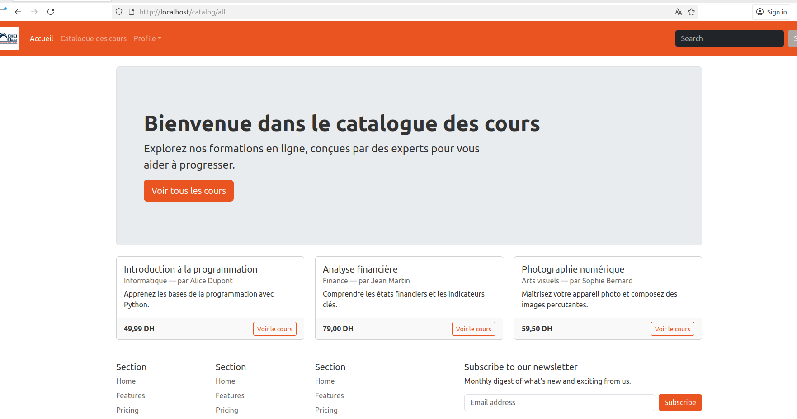

Ceci est la suite de [TP 001](Enonce001.md)

# Enoncé 002

Le but de cette partie est de se familiarier avec la manipulation des services sous Symfony

## A retenir: 

👉 Un `service` est tout simplement un objet qui accomplit une tâche ou une fonction précise au sein de votre projet.

👉 Les services sont créés et gérés par un objet spécial appelé le `Service Container` (conteneur de services). Dans Symfony, le Service Container (ou conteneur de services) est responsable de l’instanciation, de la configuration et de l’injection des dépendances des services. Il joue un rôle fondamental dans l’architecture du framework.

👉 L’`injection de dépendances` est le fait de fournir à une classe les objets dont elle a besoin via son constructeur (`__construct()`).

👉 L’`autowiring` est le fait de spécifier le type d’un argument dans le constructeur d’une classe, ce qui permet à Symfony de _deviner automatiquement_ quelle instance de service injecter.

C'est parti ! Ces définitions sont largement suffisantes pour commencer notre TP.

## Travail à faire. 

### Comprendre l'autowiring

dans le fichier `config/services.yaml`, nous avons le contenu  suivant : 


```yaml
services:
    _defaults:
        autowire: true
        autoconfigure: true

    App\:
        resource: '../src/'
        exclude:
            - '../src/Kernel.php'
            - '../src/Entity'
```

- autowire: true : permet d'activer l'autowiring. Rappel : L’autowiring permet à Symfony d’injecter automatiquement les dépendances dans les services, en se basant sur les types des arguments du constructeur ou des méthodes.
- 
    ```
    App\:
        resource: '../src/'
        exclude:
            - '../src/Kernel.php'
            - '../src/Entity'
    ```

    Elle signifie :

    -> Symfony va scanner tous les fichiers PHP dans src/ pour y détecter des classes.

    -> Toutes les classes trouvées seront enregistrées comme services si elles sont instanciables (pas abstraites, pas des interfaces, etc.).

    -> Les fichiers listés dans exclude seront ignorés.


Afin de comprendre l'effet de l'autowiring, essayons de désactiver l'autowiring pour le contrôleur `src/Controller/CatalogController.php`.

```yaml
services:
    _defaults:
        autowire: true
        autoconfigure: true

    ...

    App\Controller\CatalogController:
        autowire: false

```

Si vous visitez la page [http://localhost/catalog/all](http://localhost/catalog/all), vous devez avoir l'erreur suivante :


```
The controller for URI "/catalog/all" is not callable: Controller "App\Controller\CatalogController" cannot be fetched from the container because it is private. Did you forget to tag the service with "controller.service_arguments"?
```

Une première solution est de mettre 

```yaml 
services:
    twig:
        class: Twig\Environment
        arguments: ['@twig.loader']
        public: true

    App\Controller\CatalogController:
        autowire: false
        tags: ['controller.service_arguments']
        arguments:
            $twig: '@twig'

```

Avec la nécessité de faire 

```php

use Twig\Environment;

// retirer l'instruction extends AbstractController
class CatalogController 
{
    public function __construct(private Environment $twig)
    {
    }

    ... 

    public function all(): Response
    {
        $courses = $this->findAll(); 

        return new Response($this->twig->render('catalog/index.html.twig', [
            'courses' => $courses,
        ]));
    }
}

```

la page est désormais fonctionnelle 




Pourquoi tout cela ? En désactivant l'autowiring (`autowire: false`), nous demandons à Symfony de ne pas deviner automatiquement les services à injecter : c'est à nous de tout configurer manuellement. De plus, si nous laissons la classe `CatalogController` hériter de `AbstractController`, plusieurs autres erreurs seront déclenchées à cause de l'option `autoconfigure: true`. Nous n'avons pas encore abordé ce point dans le cours, donc nous n'en parlerons pas pour le moment. C’est pour cela que, pour le moment, nous allons nous contenter de cela.

L'aviez-vous remarqué ? Nous avons ajouté de la configuration manuelle dans `config/services.yaml`. Cette configuration demande une connaissance approfondie de Symfony, que nous n'avons pas encore acquise. De plus, désactiver l'autowiring nous impose davantage d'efforts 😐.

Oh ! avec l'ecriture suivante : 

```yaml
    App\Controller\CatalogController:
        autowire: false
        tags: ['controller.service_arguments']
        arguments:
            $twig: '@twig'
```

👉 Ici, nous avons créé un service ayant pour **ID : App\Controller\CatalogController**. En général, dans `services.yaml`, nous définissons comment le Service Container doit instancier les services. Nous indiquons au conteneur comment créer les services à travers des **définitions** de services (*Service Definitions*).

👉 Chaque service possède un **identifiant** unique dans le Service Container. Par exemple, ici : `App\Controller\CatalogController`, qui correspond au nom complet de la classe `CatalogController`. En PHP, le nom complet d’une classe (appelé *Fully Qualified Class Name*) suit la structure : `Nom\Du\Namespace\NomDeLaClasse`.

👉 On peut faire : 

```yaml
app.catalog_controller:
    class: 'App\Controller\CatalogController'
    autowire: false
    tags: ['controller.service_arguments']
    arguments:
        $twig: '@twig'
```

Ici, nous avons créé un service ayant pour ID **app.catalog_controller**, qui sera une instance de *App\Controller\CatalogController*.

👉 avec la configuration suivante : 

```yaml
    App\:
        resource: '../src/'
        exclude:
            - '../src/Kernel.php'
            - '../src/Entity'
```

Nous rendons les classes du dossier `src` disponibles pour être utilisées comme services, avec pour identifiant leur nom complet (*Fully Qualified Class Name*).

D'accord, nous avons assez parlé : passons à l'action ! 🤌

### Corriger le code

Dans le TP 001, nous avons conu les fonctions suivantes dans le controleur : 

```php
class CatalogController extends AbstractController
{
    ...

    /**
     * This function simulates **Querying course from a storage - e.h database**
     *
     * @param string $slug
     *
     * @return ?Course
     */
    private function loadCourse(string $slug): Course|null
    {
        $course = $this->findAll();

        return $course[$slug] ?? null;
    }

    private function findAll(): array
    {
        return [
            'introduction-a-la-programmation' => new Course(
                name: 'Introduction à la programmation',
                price: 49.99,
                synopsis: 'Apprenez les bases de la programmation avec Python.',
                description: 'Ce cours couvre les fondamentaux de la programmation, y compris les variables, les boucles, les fonctions et les structures de données.',
                author: new Author('Alice Dupont'),
                category: new Category('Informatique')
            ),
            'analyse-financiere' => new Course(
                name: 'Analyse financière',
                price: 79.00,
                synopsis: 'Comprendre les états financiers et les indicateurs clés.',
                description: 'Ce cours vous guide à travers l’analyse des bilans, des comptes de résultat et des flux de trésorerie.',
                author: new Author('Jean Martin'),
                category: new Category('Finance')
            ),
            'photographie-numerique' => new Course(
                name: 'Photographie numérique',
                price: 59.50,
                synopsis: 'Maîtrisez votre appareil photo et composez des images percutantes.',
                description: 'Apprenez les techniques de prise de vue, de composition, et de retouche photo avec des outils professionnels.',
                author: new Author('Sophie Bernard'),
                category: new Category('Arts visuels')
            )
        ];
    }

    private function findSimilarCourses(int $limit): array
    {
        $courses = $this->findAll();

        $keys = \array_flip(\array_rand($courses, $limit));

        return \array_intersect_ukey($courses, $keys, function (string $a, $b) {
            return $a <=> $b;
        });
    }
}
```

Ces fonctions n'ont pas leur place dans le contrôleur. Nous avons enfreint les principes *SOLID*, en particulier le S *(Single Responsibility)* 😕.

Nous avons donc décidé de les placer dans un emplacement dédié : **un service** chargé de gérer la récupération des cours.

1. Tout d'abord, reprenons le code initial: activer l'autowiring🙂. Le fichier `config/services.yaml` doit contenir :

```yaml 
parameters:

services:
    _defaults:
        autowire: true
        autoconfigure: true

    App\:
        resource: '../src/'
        exclude:
            - '../src/Kernel.php'
            - '../src/Entity'
```

2. Notre classe `CatalogController` doit hériter de la classe `AbstractController`

```php
use Symfony\Bundle\FrameworkBundle\Controller\AbstractController;

class CatalogController extends AbstractController
{

    // ...
}
```

3. Plus besoin de notre `__construct(Environment $twig)`
4. Nous sommes d'accord que `findSimilarCourses`, `findAll` et `loadCourse` ne sont pas à leur place. Vous avez donc décidé de les placer dans un service chargé de gérer la récupération des cours similaires, de tous les cours, ainsi que d’un cours à partir de son slug. 
  
    
#### 4.1. Créer le service **src/Course/Handler/DefaultCourseHandler.php**   

Dans ce service, mettre le code suivant : 
```php
<?php

namespace App\Course\Handler;

use App\DTO\Author;
use App\DTO\Category;
use App\DTO\Course;

class DefaultCourseHandler
{
    public function fetchAllCourses(): array
    {
        return [
            'introduction-a-la-programmation' => new Course(
                name: 'Introduction à la programmation',
                price: 49.99,
                synopsis: 'Apprenez les bases de la programmation avec Python.',
                description: 'Ce cours couvre les fondamentaux de la programmation, y compris les variables, les boucles, les fonctions et les structures de données.',
                author: new Author('Alice Dupont'),
                category: new Category('Informatique')
            ),
            'analyse-financiere' => new Course(
                name: 'Analyse financière',
                price: 79.00,
                synopsis: 'Comprendre les états financiers et les indicateurs clés.',
                description: 'Ce cours vous guide à travers l’analyse des bilans, des comptes de résultat et des flux de trésorerie.',
                author: new Author('Jean Martin'),
                category: new Category('Finance')
            ),
            'photographie-numerique' => new Course(
                name: 'Photographie numérique',
                price: 59.50,
                synopsis: 'Maîtrisez votre appareil photo et composez des images percutantes.',
                description: 'Apprenez les techniques de prise de vue, de composition, et de retouche photo avec des outils professionnels.',
                author: new Author('Sophie Bernard'),
                category: new Category('Arts visuels')
            )
        ];
    }

    public function getCourseBySlug(string $slug): Course|null
    {
        $course = $this->fetchAllCourses();

        return $course[$slug] ?? null;
    }

    public function findSimilarCourses(int $limit): array
    {
        $courses = $this->fetchAllCourses();

        $keys = \array_flip(\array_rand($courses, $limit));

        return \array_intersect_ukey($courses, $keys, function (string $a, $b) {
            return $a <=> $b;
        });
    }
}

```

#### 4.2 Dans src/Controller/CatalogController.php

Dans ce controleur, mettre le code suivant :

```php
<?php

declare(strict_types=1);

namespace App\Controller;

use App\Course\Handler\DefaultCourseHandler;
use Symfony\Bundle\FrameworkBundle\Controller\AbstractController;
use Symfony\Component\HttpFoundation\Response;
use Symfony\Component\Routing\Attribute\Route;

#[Route(path: '/catalog', name: 'app_catalog_')]
class CatalogController extends AbstractController
{
    public function __construct(private readonly DefaultCourseHandler $courseHandler)
    {
    }

    #[Route(path: '/{slug}', name: 'view')]
    public function show(string $slug): Response
    {
        $course = $this->courseHandler->getCourseBySlug($slug); // simulate loading this course from the storge (from API or Database)

        if (null === $course) {
            throw $this->createNotFoundException('La page que vous demandez est introuvable.');
        }

        return $this->render('catalog/show.html.twig', [
            'course' => $course,
        ]);
    }

    #[Route(path: '/all', name: 'all', priority: 1)]
    public function all(): Response
    {
        $courses = $this->courseHandler->fetchAllCourses(); // simulate loading this course from the storge (from API or Database)

        return $this->render('catalog/index.html.twig', [
            'courses' => $courses,
        ]);
    }

    public function similarCourses(int $limit = 2): Response
    {
        $similarCourses = $this->courseHandler->findSimilarCourses($limit);

        return $this->render('catalog/similar_courses.html.twig', [
            'courses' => $similarCourses,
        ]);
    }
}

```

#### 4.3 Comprendre ce que nous avons fait

Nous avons commencé à communiquer avec le *modèle* dans l’architecture MVC. Ici, nous disposons d’un service contenant trois méthodes, chacune centrée sur une fonctionnalité bien précise. Le contrôleur, quant à lui, appelle ce service pour lui demander de lui retourner le résultat attendu.

#### 4.4 La Factory (Factory Design Pattern)

Bien qu’ici la factory n’apporte aucune valeur ajoutée, je voulais vous présenter une technique pour mettre en œuvre le patron de conception `Factory`.

Le rôle de la factory est de créer les instances de **Course** utilisées dans la méthode `fetchAllCourses()`.La factory n’est pas vraiment utile dans ce cas précis ; l’objectif est simplement de vous présenter une technique supplémentaire 😁.

- Créer le service : `src/Course/Factory/AbstractCourseFactory.php`

```php
<?php

namespace App\Course\Factory;

use App\DTO\Course;

abstract class AbstractCourseFactory
{
    abstract public function create(array $data): Course;
}

```

- Créer une factory qui permettra de créer les instances à partir d'un tableau . Cette factory est très basique : 

```php
<?php

namespace App\Course\Factory;

use App\DTO\Author;
use App\DTO\Category;
use App\DTO\Course;

class DefaultCourseFactory extends AbstractCourseFactory
{
    public function create(array $data): Course
    {
        return new Course(
            category: new Category($data['category']),
            name: $data['name'],
            description: $data['description'],
            synopsis: $data['synopsis'],
            price: $data['price'],
            author: new Author($data['author']),
        );
    }
}

```

- Dans `src/Course/Handler/DefaultCourseHandler.php` mettre le code suivant 

```php
<?php

namespace App\Course\Handler;

use App\Course\Factory\DefaultCourseFactory;
use App\DTO\Course;

class DefaultCourseHandler
{
    public function __construct(
        private readonly DefaultCourseFactory $factory,
    ) {

    }


    public function fetchAllCourses(): array
    {
        return [
            'introduction-a-la-programmation' => $this->factory->create([
               'name' => 'Introduction à la programmation',
               'price' => 49.99,
               'synopsis' => 'Apprenez les bases de la programmation avec Python.',
               'description' => 'Ce cours couvre les fondamentaux de la programmation, y compris les variables, les boucles, les fonctions et les structures de données.',
               'author' => 'Alice Dupont',
               'category' => 'Informatique',
            ]),
            'analyse-financiere' => $this->factory->create([
                'name' => 'Analyse financière',
                'price' => 79.00,
                'synopsis' => 'Comprendre les états financiers et les indicateurs clés.',
                'description' =>'Ce cours vous guide à travers l’analyse des bilans, des comptes de résultat et des flux de trésorerie.',
                'author' => 'Jean Martin',
                'category' => 'Finance',
            ]),
            'photographie-numerique' => $this->factory->create([
                'name' => 'Photographie numérique',
                'price' => 59.50,
                'synopsis' => 'Maîtrisez votre appareil photo et composez des images percutantes.',
                'description' => 'Apprenez les techniques de prise de vue, de composition, et de retouche photo avec des outils professionnels.',
                'author' => 'Sophie Bernard',
                'category' => 'Arts visuels',
            ])
        ];
    }

    public function getCourseBySlug(string $slug): Course|null
    {
        $course = $this->fetchAllCourses();

        return $course[$slug] ?? null;
    }

    public function findSimilarCourses(int $limit): array
    {
        $courses = $this->fetchAllCourses();

        $keys = \array_flip(\array_rand($courses, $limit));

        return \array_intersect_ukey($courses, $keys, function (string $a, $b) {
            return $a <=> $b;
        });
    }
}

```

Pour bien comprendre la différence entre les *interfaces* et *les classes abstraites*, je vous propose d’adopter le réflexe suivant :

la fonction *findSimilarCourses*

```php
    public function findSimilarCourses(int $limit): array
    {
        $courses = $this->fetchAllCourses();

        $keys = \array_flip(\array_rand($courses, $limit));

        return \array_intersect_ukey($courses, $keys, function (string $a, $b) {
            return $a <=> $b;
        });
    }
```

ajoute un *comportement* au handler. Les handlers qui implémentent cette interface devront fournir leur propre logique pour récupérer les cours similaires.

Pour mettre cela en place, je vous propose de créer une interface dans `src/Course/Handler/`, que nous appellerons `SimilarCourseProviderInterface`.

```php
<?php

namespace App\Course\Handler;

use App\DTO\Course;

interface SimilarCourseProviderInterface
{
    public function getSimilarCourses(Course $course, int $limit): array;
}

```

Ensuite, nous souhaitons que notre `DefaultCourseHandler` ait la capacité de trouver les cours similaires au cours passé en argument : 


```php

class DefaultCourseHandler implements SimilarCourseProviderInterface
{
    // ...

    public function getSimilarCourses(Course $course, int $limit): array
    {
        $courses = $this->fetchAllCourses(); // <-- Ceci est juste pour avoir une liste de cours pour filtrer

        $keys = \array_flip(\array_rand($courses, $limit));

        return \array_intersect_ukey($courses, $keys, function (string $a, $b) {
            return $a <=> $b;
        });
    }
}

```

Ici, nous avons implémenté une interface parceque le comportement de la récupération des cours similaires peut changer d'un handler à un autre. 

- 🤌 **$courses = $this->fetchAllCourses();** est là juste pour des raisons de tests. Normalement, nous devons prendre en compte le cours en argument `Course $course` pour lequel, nous allons calculer la similarité.


> Donc, avons utilisé l'interface car nous avons remarqué que la récupération des cours similaires est un `comportement` et ne peut pas être général (c'est pour cela que nous n'avons pas opté à une classe abstraite).

> AbstractCourseFactory est créé car toutes les factory (par exemple DefaultCourseFactory) sont des 'AbstractCourseFactory' et elles sont des propriétés / méthodes en commun