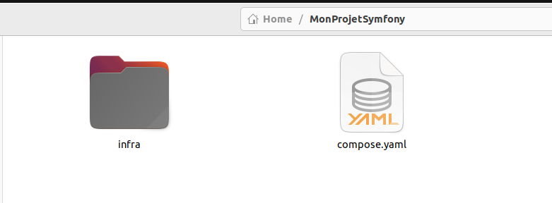
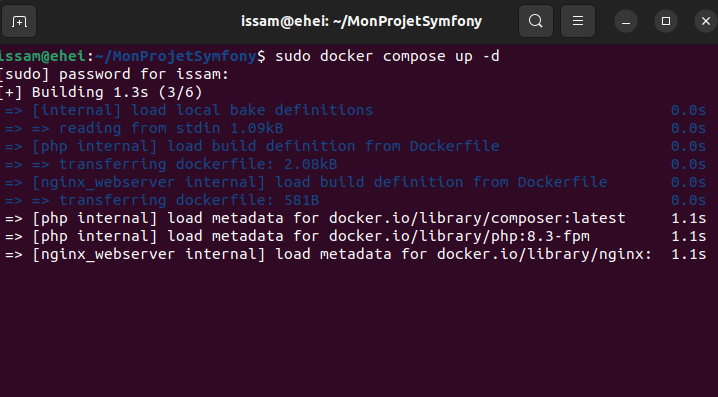
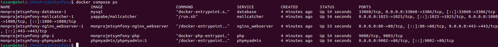
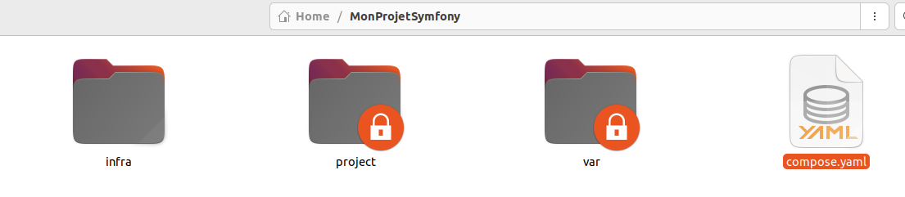
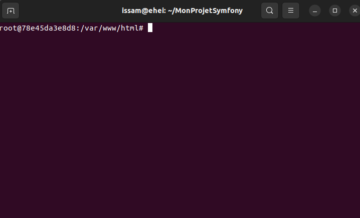
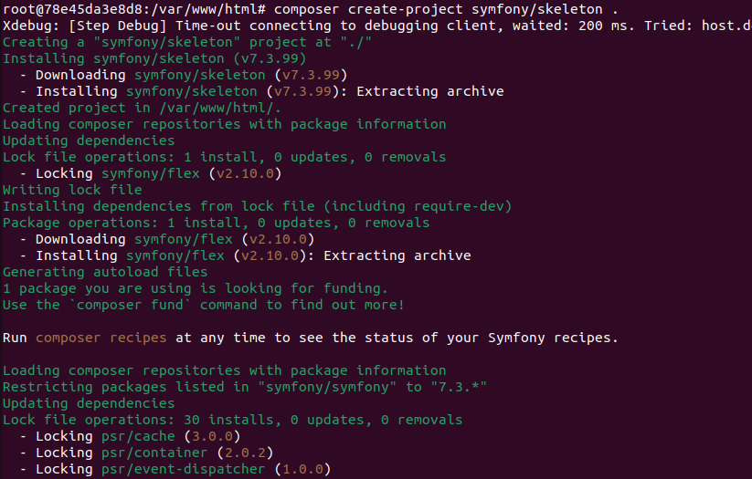
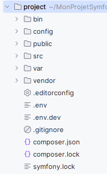
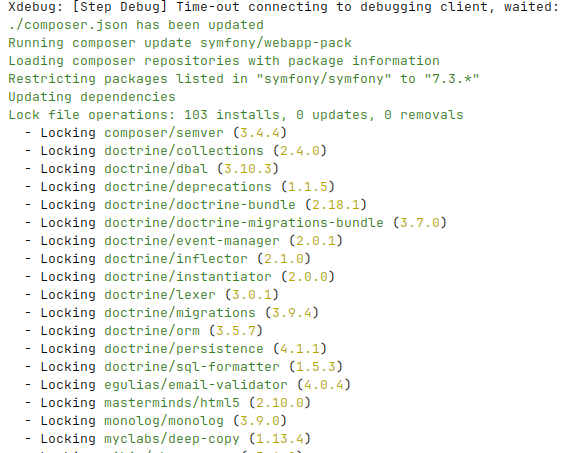
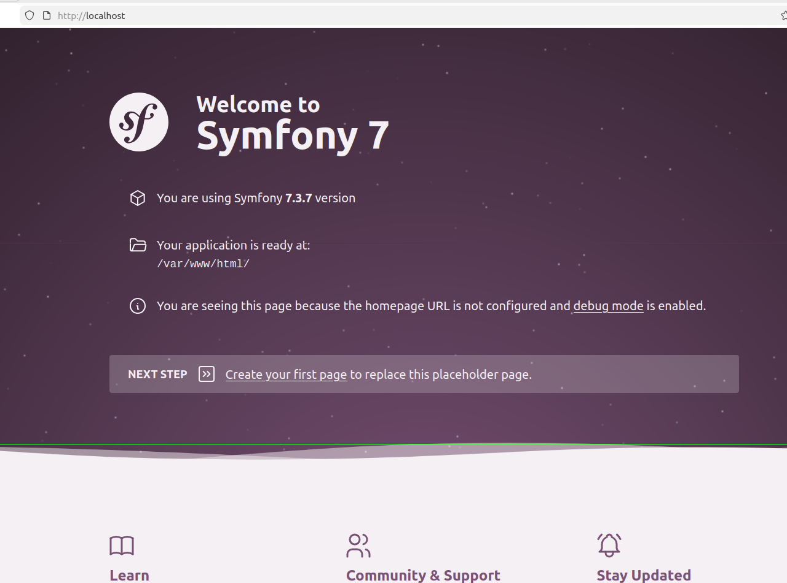

# Installer Symfony en local avec Docker.

- Sur votre machine virtuelle, créer un nouveau dossier qui va contenir votre projet Symfony (par exemple dans `~/Projects/MonProjetSymfony`)
- Télécharger les dossiers depuis [Ce repo](https://github.com/issamkhadiri1989/symfony_docker_infra.git). Ce dossier contient :

    - dossier `infra`
    - fichier `compose.yaml`

- Dézippez le contenu de dossier téléchargé dans la racine de votre projet: 



- Ouvrez votre terminal dans ce dossier puis lancer les commandes suivantes:

    - Stopper tous les containers afin de ne pas avoir des conflits de ports encours d'occupation: `sudo docker stop $(docker ps -aq)`

    - Démarrer les containers avec : `sudo docker compose up -d`

    

    - Lancer la commande suivante pour vérifier que tous les containers sont démarrés sans erreur: `sudo docker compose ps`

    

    tous les containers sont en état **UP** ✅

    - Vous avez remarqué que le dossier `project` est créé sur la racine de votre projet 

    

    c'est le dossier qui contiendra votre projet Symfony.

    - Maintenant, pour que vous puissez exécuter les commandes pour créer le projet Symfony et mêmes toutes les autres commandes, il faut accéder au container *php* avec la commande `sudo docker compose exec php bash`. Vous devez avoir le resultat suivant 

    

    - Créer un projet vierge Symfony: `composer create-project symfony/skeleton .` (ou `composer create-project symfony/skeleton:"7.3.x" .` si vous souhaitez installer une version précise)

    

    Cette version est largement suffisante si vous souhaitez construire des APIs, Microservices ... 

    

    Si vous souhaitez installer la version complète de Symfony, il faut lancer la commande: `composer require webapp`

    

    Répondez **N** à cette question:

    ```
    Do you want to include Docker configuration from recipes?
    [y] Yes
    [n] No
    [p] Yes permanently, never ask again for this project
    [x] No permanently, never ask again for this project
    (defaults to y): n 
    ```
- Visitez la page [Accueil](http://localhost) pour vérifier que votre projet tourne correctement

