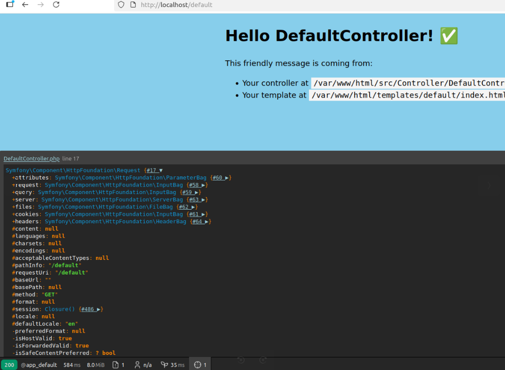
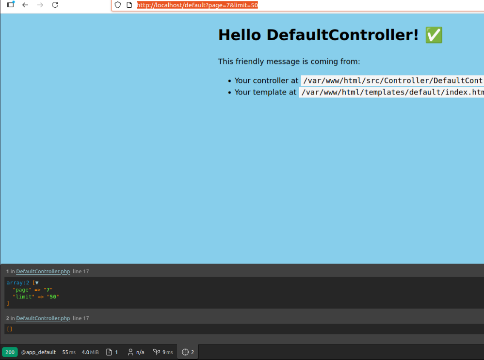
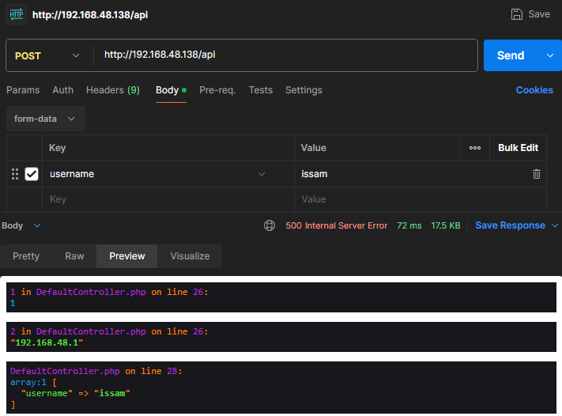
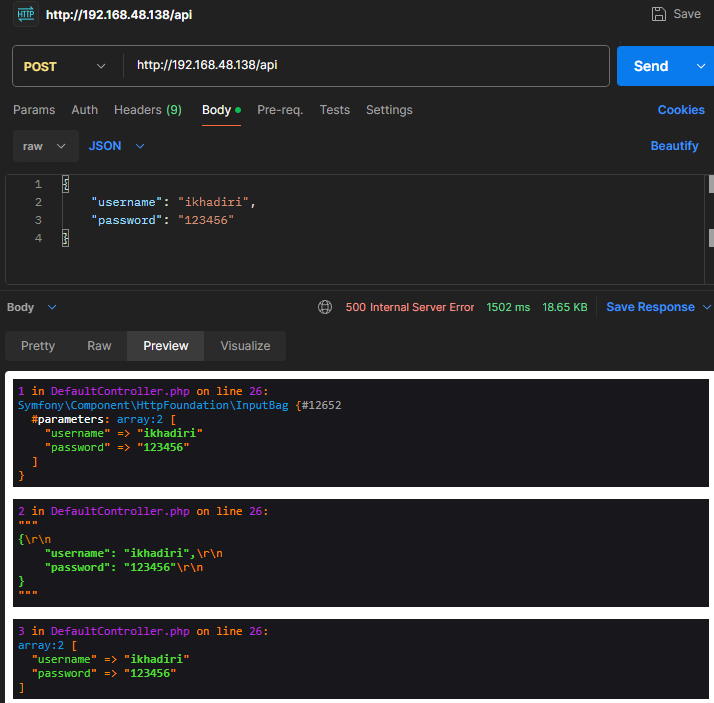
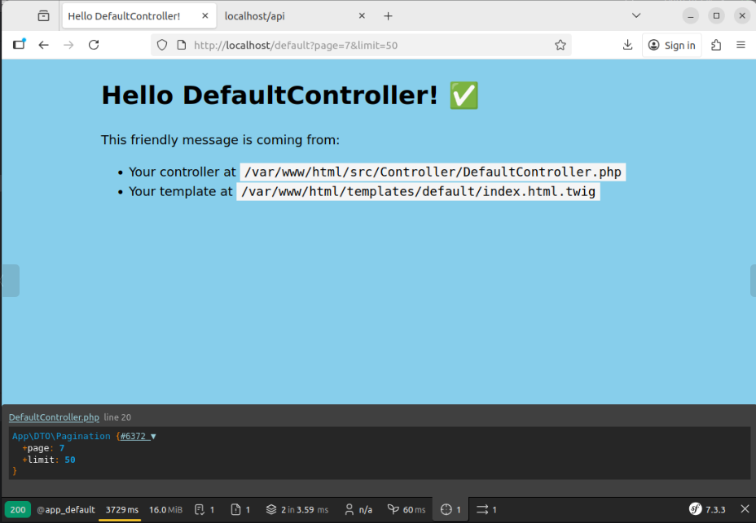
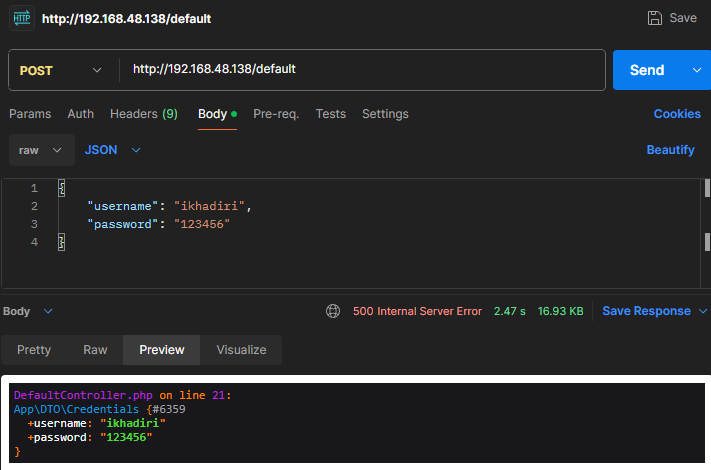

# Découvrir l'objet Request

## 1- But de cet exercice

Apprendre à utiliser l’objet Request de Symfony et découvrir ses méthodes les plus utiles.

## 2- Travail à faire

### 2-1 Avant de commencer

Vérifiez que les conteneurs Docker sont en cours d’exécution. Lancez-les avec la commande `make start` si nécessaire.

### 2-2 Créer un controleur

1. Créer votre premier controleur en lancant la commande `php bin/console make:controller DefaultController` 

2. Dans l'action index() mettez le code suivant: 

```php
<?php

declare(strict_types=1);

namespace App\Controller;

use Symfony\Bundle\FrameworkBundle\Controller\AbstractController;
use Symfony\Component\HttpFoundation\Request;
use Symfony\Component\HttpFoundation\Response;
use Symfony\Component\Routing\Attribute\Route;

final class DefaultController extends AbstractController
{
    #[Route('/default', name: 'app_default')]
    public function index(Request $requestObject): Response
    {
        dump($requestObject);

        return $this->render('default/index.html.twig', [
            'controller_name' => 'DefaultController',
        ]);
    }
}

```

3. Visiter la page [http://localhost/default](http://localhost/default)

Vous venez de créer votre première page.

#### Le profiler

Sur la page, vous verrez une barre noire en bas. Il s'agit du _`profiler`_.



Cliquez sur un menu du profiler pour découvrir les différentes options disponibles.

### 3- Gestion de la requête

Il est temps de manipuler l’objet `Request`. Passons à la pratique ! 

1. Dans votre contrôleur, ajoutez les instructions suivantes :

```php
    #[Route('/default', name: 'app_default')]
    public function index(Request $requestObject): Response
    {
        dump($requestObject->query->all(), $requestObject->request->all());

        return $this->render('default/index.html.twig', [
            'controller_name' => 'DefaultController',
        ]);
    }
```
2. Rechargez votre page ([http://localhost/default?page=1&limit=10](http://localhost/default?page=1&limit=10))

3. Sur le profiler, vous devez voir 



- l'attribut **request**: equivalent de _$_POST_;
- l'attribut **query**: equivalent de _$_GET_;
- l'attribut **server**: equivalent de _$_SERVER_;
- l'attribut **headers**: reflète un sous ensemble de _$_SERVER_ ($request->headers->get('User-Agent')).

(besoin de plus de détails, voir [La doc](https://symfony.com/doc/current/components/http_foundation.html#accessing-request-data))

4. Essayez de récupérer une données en utilisant les attributs ci-dessus. Par exemple 

```php

    public function index(Request $requestObject): Response
    {

        // ...

        $page = $requestObject->query->get('page', 1);
        $page = $requestObject->query->getInt('page', 1);

        $clientIpAddress = $requestObject->server->get('REMOTE_ADDR');


        dump($page, $clientIpAddress);

        return $this->render('default/index.html.twig', [
            'controller_name' => 'DefaultController',
        ]);
    }
```

5. Pour tester la méthode POST ou  si vous écrivez une API, vous pouvez utiliser `Postman`

```php

    #[Route('/api', name: 'app_api')]
    public function index(Request $requestObject): Response
    {

        dd(
            $requestObject->request->all(),
            $requestObject->getPayload(),
        );

        return $this->render('default/index.html.twig', [
            'controller_name' => 'DefaultController',
        ]);
    }
```

Pour voir les paramètres envoyés avec un formulaire en `POST` (ici Postman juste pour simuler le formulaire)



Pour simuler une API: 

```php

    #[Route('/api', name: 'app_api')]
    public function index(Request $requestObject): Response
    {
       // ...

        dd(
            $requestObject->request->all(),
            $requestObject->getPayload(),
            $requestObject->getContent(),
            $requestObject->toArray(),
        );

    }
```



> Soyez attentifs aux options qu'elles sont montrées dans les screenshots.

### 4- Bonus

Vous souhaitez éviter de manipuler les paramètres sous forme de tableaux et préférez travailler avec des DTO ? Ok, vous pouvez donc utiliser les attributs suivants: 

- **Symfony\Component\HttpKernel\Attribute\MapQueryString :** 

```php
<?php

// src/DTO/Pagination.php

declare(strict_types=1);

namespace App\DTO;
class Pagination
{
    public int $page = 1;
    public int $limit = 10;
}

```

Ensuite, dans votre contrôleur 

```php
use Symfony\Component\HttpKernel\Attribute\MapQueryString;

#[Route('/default', name: 'app_default')]
public function index(#[MapQueryString] Pagination $pagination): Response
{
    dump($pagination);

    return $this->render('default/index.html.twig', [
        'controller_name' => 'DefaultController',
    ]);
}

```




- **Symfony\Component\HttpKernel\Attribute\MapRequestPayload :**

```php
<?php

// src/DTO/Credentials.php

namespace App\DTO;

class Credentials
{
    public function __construct(
        public string $username,
        public string $password,
    ) {

    }
}
```

Dans votre controleur vous pouvez faire 

```php
use App\DTO\Credentials;
use Symfony\Component\HttpKernel\Attribute\MapRequestPayload;

public function index(#[MapRequestPayload] Credentials $credentials): Response
{
    dd($credentials);

    return $this->render('default/index.html.twig', [
        'controller_name' => 'DefaultController',
    ]);
}
```



Pour plus de détails voir [la doc](https://symfony.com/blog/new-in-symfony-6-3-mapping-request-data-to-typed-objects) 


⚠️ Sur les captures, l’adresse IP _192.168.48.138_ correspond à celle de ma machine virtuelle. Les requêtes ont été envoyées depuis ma machine réelle vers la VM. Vous pouvez avoir une adresse IP différente selon votre configuration. Pour connaître l’adresse IP de votre machine virtuelle, exécutez la commande `hostname -I`.
