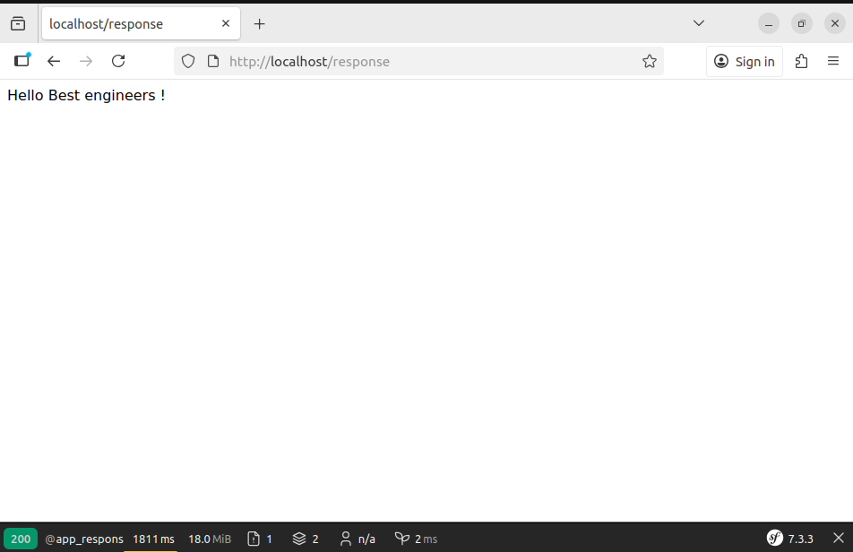
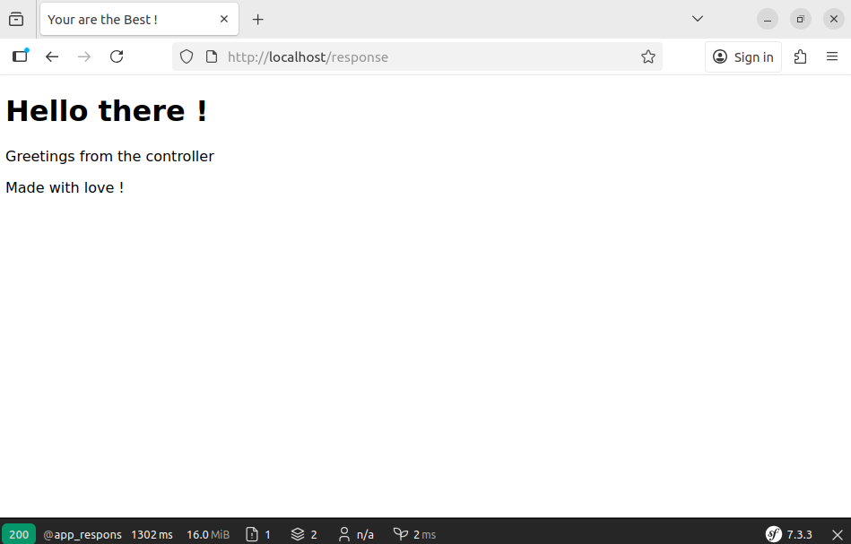
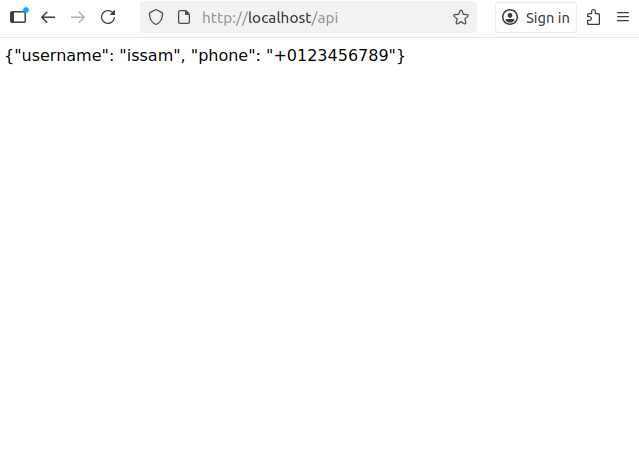
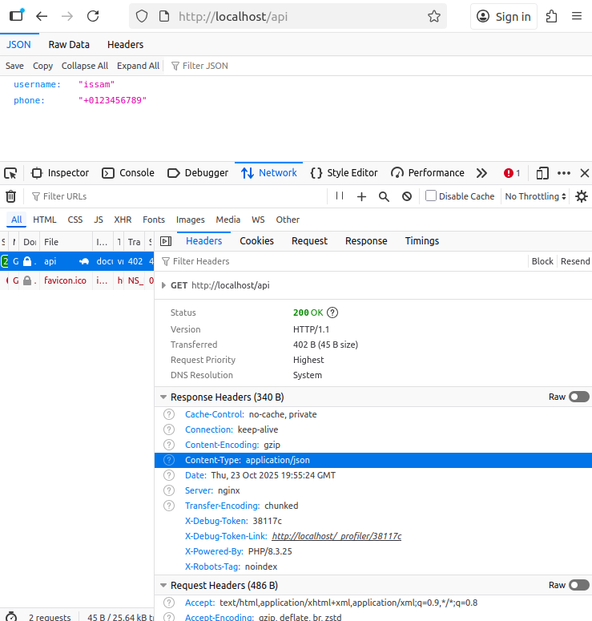
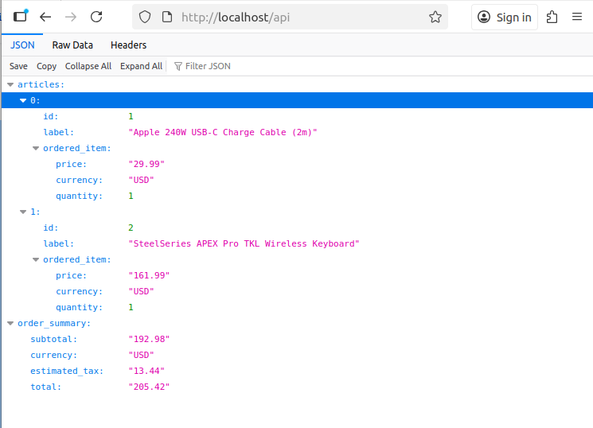
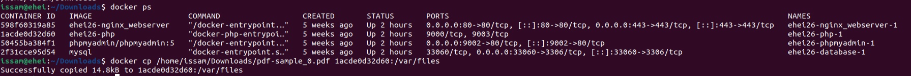
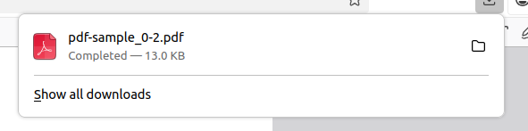

# Découvrir l'objet Response

## 1- But de cet exercice

Apprendre à utiliser l’objet Response de Symfony et découvrir ses méthodes les plus utiles.

## 2- Travail à faire

### 2-1 Avant de commencer

Vérifiez que les conteneurs Docker sont en cours d’exécution. Lancez-les avec la commande `make start` si nécessaire.

### 2-2 Créer un controleur

1. Créer un controleur en lancant la commande `php bin/console make:controller ResponseController` 

2. Découvez les différentes réponses sous Symfony 

#### Repsonse HTML simple: 

```php
<?php

namespace App\Controller;

use Symfony\Bundle\FrameworkBundle\Controller\AbstractController;
use Symfony\Component\HttpFoundation\Response;
use Symfony\Component\Routing\Attribute\Route;

final class ResponseController extends AbstractController
{
    #[Route('/response', name: 'app_response')]
    public function index(): Response
    {
        $response = new Response('<!doctype html><html><body>Hello Best engineers !</body></html>');
        
        return $response;
    }
}
```
sur votre navigateur, aller sur [http://localhost/response](http://localhost/response) vous devez voir 



Vous avez sans doute remarqué qu’il n’est pas très pratique d’écrire du code HTML directement dans le contrôleur. Faisons les choses proprement :

- Votre classe contrôleur doit hériter de `Symfony\Bundle\FrameworkBundle\Controller\AbstractController`.
- Cette classe propose une méthode très pratique appelée `render()`.
- Le premier argument de cette méthode est le nom de la **vue** (template) à afficher pour l’utilisateur. Elle accepte également d’autres arguments, mais ce n’est pas nécessaire de les connaître pour l’instant.
- La méthode `render()` va récupérer le contenu de la template, créer un objet Response et le retourner.
- Dans notre cas, il suffit simplement de retourner ce résultat.

Dans le dossier `templates/response`, créez une template nommée *index.html.twig* et ajoutez-y le contenu suivant :

```twig
<html>
    <head>
        <meta charset="UTF-8">
        <title>Your are the Best !</title>
    </head>
    <body>
        <div class="example-wrapper">
            <h1>Hello there !</h1>
            <p> Greetings from the controller </p>
            <p>Made with love !</p>
        </div>
    </body>
</html>
```

et mettez à jour votre controleur comme ceci : 

```php
// src/Controller/Response.php
<?php

namespace App\Controller;

use Symfony\Bundle\FrameworkBundle\Controller\AbstractController;
use Symfony\Component\HttpFoundation\Response;
use Symfony\Component\Routing\Attribute\Route;

final class ResponseController extends AbstractController
{
    #[Route('/response', name: 'app_response')]
    public function index(): Response
    {
        return $this->render('response/index.html.twig', [
            'controller_name' => 'ResponseController',
        ]);
    }
}
```

Sur votre navigateur, allez à l’adresse [http://localhost/response](http://localhost/response) : vous devriez voir s’afficher le contenu de la vue que vous avez créée.



#### Réponse JSON (une API par exemple)

Imaginons que vous souhaitiez retourner un résultat au format JSON. Dans votre contrôleur, créez une nouvelle action appelée `api()` et configurez-la pour qu’elle soit accessible via l’URL `/api`.

```php
    #[Route('/api', name: 'api_response')]
    public function api(): Response
    {
        return new Response('{"username": "issam", "phone": "+0123456789"}');
    }
```

Sur votre navigateur, allez à l’adresse [http://localhost/api](http://localhost/api) : vous devriez voir s’afficher le contenu de la vue que vous avez créée.



Ceci n’est pas correct ❌ : normalement, lorsqu’on retourne une réponse JSON, l’un des en-têtes (headers) de la réponse doit être Content-Type: application/json. Corrigeons cela !

```php
    #[Route('/api', name: 'api_response')]
    public function api(): Response
    {
        $response = new Response('{"username": "issam", "phone": "+0123456789"}');

        $response->headers->set('Content-Type', 'application/json');
        
        return $response;
    }
```

Sur votre navigateur, allez à l’adresse [http://localhost/api](http://localhost/api) : vous devriez voir s’afficher le contenu de la vue que vous avez créée.



Oui ✅, c’est une réponse correcte. Mais l’avons-nous bien appliquée ? Oui, et pourtant… on peut encore faire mieux !

sur votre controleur, changer le code comme ceci: 

```php
use Symfony\Component\HttpFoundation\JsonResponse;


#[Route('/api', name: 'api_response')]
public function api(): Response
{
   return new JsonResponse(data: '{"username": "issam", "phone": "+0123456789"}', json: true);
}
```

ou si vous disposez d'un tableau (résultat depuis la base de données par exemple) et vous souhaitez l'exposer en JSON : (supposons une endpoint qui expose l'état du panier)

```php
    #[Route('/api', name: 'api_response')]
    public function api(): Response
    {
        $cart = [
            'articles' => [
                [
                    'id' => 1,
                    'label' => 'Apple 240W USB-C Charge Cable (2m)',
                    'ordered_item' => [
                        'price' => '29.99',
                        'currency' => 'USD',
                        'quantity' => 1,
                    ],
                ],
                [
                    'id' => 2,
                    'label' => 'SteelSeries APEX Pro TKL Wireless Keyboard',
                    'ordered_item' => [
                        'price' => '161.99',
                        'currency' => 'USD',
                        'quantity' => 1,
                    ],
                ],
            ],
            'order_summary' => [
                'subtotal' => '192.98',
                'currency' => 'USD',
                'estimated_tax' => '13.44',
                'total' => '205.42'
            ],
        ];

        return new JsonResponse(data: $cart, json: false);
    }
```

Sur votre navigateur, allez à l’adresse [http://localhost/api](http://localhost/api) : vous devriez voir s’afficher le contenu de la vue que vous avez créée.



Vous ne souhaitez pas créer l’objet `JsonResponse` manuellement ? Pas de souci. Grâce à la classe `AbstractController`, on peut faire encore mieux :

```php

#[Route('/api', name: 'api_response')]
public function api(): Response
{
    // ...

    return $this->json(data: $cart, );
}

```

#### Télécharger un fichier (PDF)

Pour le test, téléchargez un fichier PDF — par exemple [celui-ci](https://www.rd.usda.gov/sites/default/files/pdf-sample_0.pdf) — et placez-le sur votre machine (pas nécessairement dans le dossier du projet).

Admettons que le fichier existe dans le répertoire `/var/files` dans le container `php` ⚠️ . Le chemin complet du fichier est donc : `/var/files/pdf-sample_0.pdf`. 

⚠️ Il est très important que le fichier se trouve dans le conteneur `php`. **Je le répète** : votre application est hébergée dans le conteneur `php`, et non sur votre machine réelle (VM). Si vous souhaitez transférer un fichier depuis la machine hôte vers le conteneur `php`, suivez les étapes suivantes :

- Localisez votre fichier (dans mon cas, il se trouve dans `/home/issam/Downloads`).

- Lancez la commande `docker ps` depuis n’importe quel terminal sur votre machine hôte. Cela vous permettra de lister tous les conteneurs en cours d’exécution.

- Notez l’ID du conteneur concerné (dans mon exemple, il s’agit de *1acde0d32d60*).

- Assurez-vous que le dossier `/var/files` est bien créé dans le container. Si ce n'est encore fait, exécutez la commande `make enter service=php` puis `mkdir /var/files`.

- Lancez la commande `docker cp /home/issam/Downloads/pdf-sample_0.pdf 1acde0d32d60:/var/files`




Nous savons désormais créer des routes dynamiques. Nous pouvons donc créer une route qui accepte le nom d’un fichier en paramètre. 
Le contrôleur va d’abord vérifier si le fichier existe. Si c’est le cas, le fichier est téléchargé ; sinon, une erreur 404 est déclenchée.

```php
use Symfony\Component\HttpFoundation\BinaryFileResponse;
use Symfony\Component\HttpFoundation\ResponseHeaderBag;

#[Route(path: '/file/download/{fileName}', name: 'app.download')]
public function downloadPdf(string $fileName): BinaryFileResponse
{
    if (\file_exists($filePath = '/var/files/' . $fileName) === false) {
        throw $this->createNotFoundException('Le fichier que vous cherchez est introuvable.');
    }

    return new BinaryFileResponse(file: $filePath, contentDisposition: ResponseHeaderBag::DISPOSITION_ATTACHMENT);
}
```

Sur votre navigateur, allez à l’adresse [http://localhost/file/download/pdf-sample_0.pdf](http://localhost/file/download/pdf-sample_0.pdf) : vous devriez voir le fichier entrain de se télécharger



Vous ne souhaitez pas créer l’objet `BinaryFileResponse` manuellement ? Pas de souci. Grâce à la classe `AbstractController`, on peut faire encore mieux :

```php

    #[Route(path: '/file/download/{fileName}', name: 'app.download')]
    public function downloadPdf(string $fileName): BinaryFileResponse
    {
        // ...

        return $this->file(
            fileName: 'dummy.pdf',
            file: $filePath,
        );
    }
```
