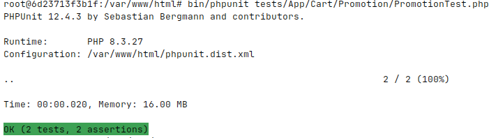
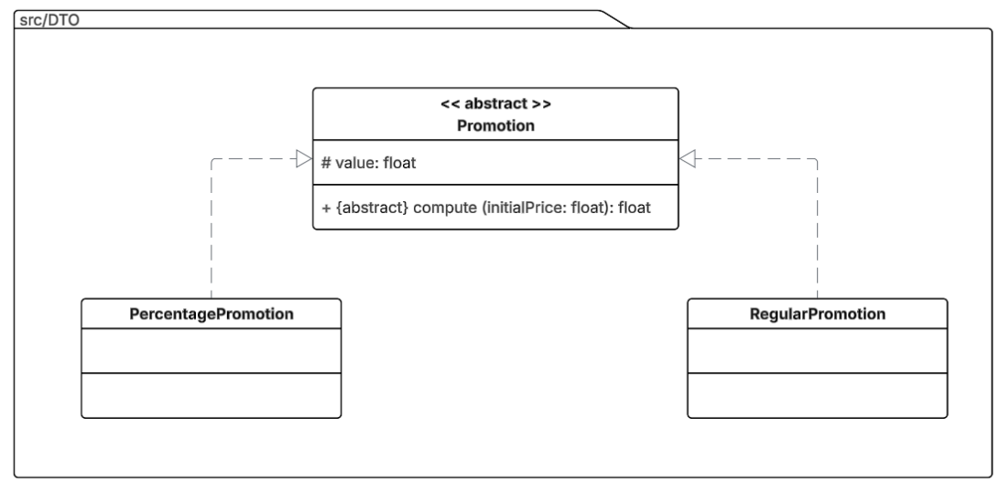
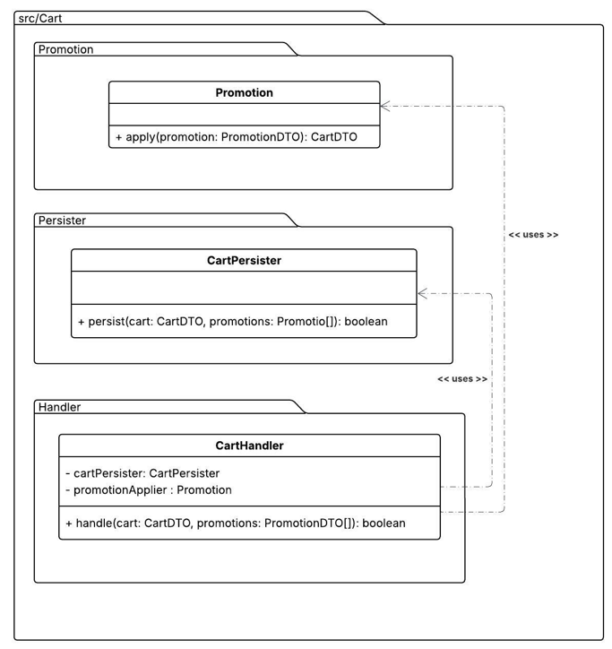
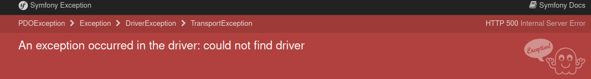
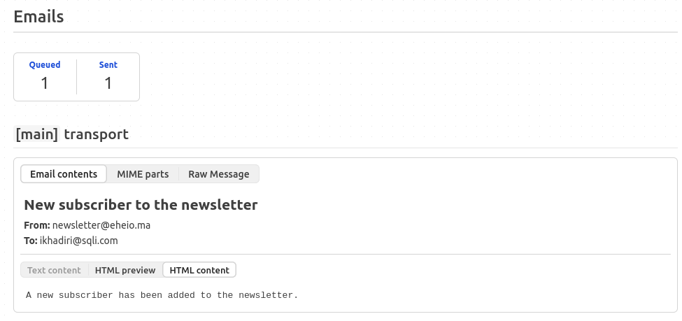
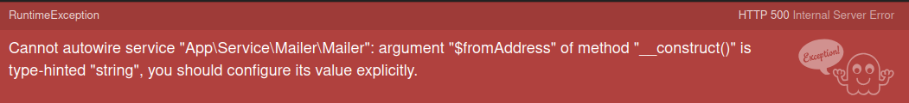
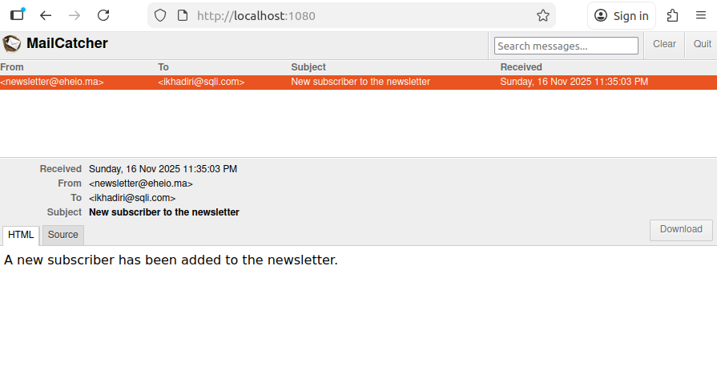

# Injection de dépendances: Se familiariser avec les services

## But de l'exercice

Se familiariser avec les services

## Pre-Exercice

Cette section est destinée aux personnes rencontrant des difficultés avec leur projet Symfony. 

Suite à la demande de certains d'entre vous, je vous ai préparer une liste d'étapes afin d'installer votre projet Symfony sans utiliser les commandes `make` afin de vous familiariser avec les commandes `docker`. Lire [Les instructions](000.Installation.md)

Si votre projet Symfony fonctionne correctement, vous pouvez passer directement à l’étape suivante.

Dans ce document, vous auriez 2 Exercices : 

- Appliquer une promotion sur une commande
- Envoi de mail: Votre site doit envoyer 3 types de mails (newsletter, inscription, erreur système)


# Exercice 1

## Appliquer une promotion sur une commande

> ⚠️ <span style="color:#F2CB05">Vous devez garder les noms que je vous donne ci-après car vous devez corriger les conflits des noms comme vu dans le cours</span>


Vous êtes entrain de développer un site e-commerce. L'une des parties la plus importante est la gestion du panier. Vous avez décidé d'écrire la logique sous forme de services.

#### 1.1 - Gestion de promotions

Le but ici est d’écrire un système de services qui cohabitent et permettent de gérer l’application des promotions sur un panier.

Comme vous aviez déjà mentionné avoir travaillé avec le **TDD** (Test Driven Development – Développement guidé par les tests), nous allons essayer cette technique ici puisque nous n’avons pas de moyen de vérifier que les services sont corrects (pas de formulaires, pas de contrôleurs...).

- Installer le pack des tests unitaires (phpunit) en lancant la commande: `composer require --dev symfony/test-pack` (à l'intérieur du container *php*)

- Vous devez créer un test unitaire pour tester les cas suivants: 

**Promotions**

1) `testComputeRegularPromotion` : ce test vérifie le calcul d’une promotion en appliquant une promotion régulière.

Si une promotion réguliaire est de *-200,00 dhs* sur un montant total de *1500,00 dhs*, le montant final net doit être *1300,00 dhs*

2) `testComputePercentagePromotion` : ce test vérifie le calcul d’une promotion en appliquant une promotion en pourcentage.

Si une promotion est de *-20%* sur un montant total de *1500,00 dhs*, le montant final net doit être *1500,00 - 20% = 1200,00 dhs* car 20% de 1500,00 = 300dhs => 1500 - 300 = *1200, 00 dhs*

le test unitaire final doit être: 

```php
// tests/App/Cart/Promotion/PromotionTest.php

<?php

namespace App\Tests\App\Cart\Promotion;

use App\Cart\Promotion\Promotion;
use App\DTO\Cart;
use App\DTO\PercentagePromotion;
use App\DTO\RegularPromotion;
use PHPUnit\Framework\TestCase;

class PromotionTest extends TestCase
{
    public function testComputeRegularPromotion(): void
    {
        $promotionManager = new Promotion();

        $regularPromotion = new RegularPromotion(200.00);
        $cart = new Cart(1500.00);

        $cart = $promotionManager->apply(promotion: $regularPromotion, cart: $cart);

        $this->assertEquals(1300.00, $cart->getTotalNetPrice());
    }

    public function testComputePercentagePromotion(): void
    {
        $promotionManager = new Promotion();

        $regularPromotion = new PercentagePromotion(20.00);
        $cart = new Cart(1500.00);

        $cart = $promotionManager->apply(promotion: $regularPromotion, cart: $cart);

        $this->assertEquals(1200.00, $cart->getTotalNetPrice());
    }
}

```

⚠️  <span style="color:#F2CB05">you can write other unit tests.</span>


En Symfony, pour lancer les tests uniataire, il faut lancer la commande `bin/phpunit tests/` ou  pour un test précis `bin/phpunit tests/App/Cart/Promotion/PromotionTest.php`

Vous devez arriver au resultat suivant : 



#### 1.2 - Développement du code production  (Logique pour corriger les tests unitaires)

- Créer deux classes DTO dans **src/DTO** : *RegularPromotion* et *PercentagePromotion*, qui représentent respectivement une promotion régulière (prix final = prix initial − montant de la promotion) et une promotion avec pourcentage (prix final = prix initial − % de réduction).



> ❓ <span style="color:#FF5F5D">Selon vous ? pourquoi nous avons une classe abstraite `Promotion` ici ? et pour quelle raison nous avons la méthode `compute()` abstraite ?</span>


- Afin de séparer les logiques, vous avez décider d'organiser vos services de la manière suivante :

    - Application de la promotion: Gérée par le service `src/Cart/Promotion/Promotion.php`
    - Persister (sauvegarder) le panier en base de données, session, API ... : il s'agit du service `src/Cart/Persist/CartPersister.php`
    - Gestion du Panier = liaison entre le Persister et les Promotions. Il s'agit de `src/Cart/Handler/CartHandler.php`



*Rappel* : si vous souhaitez représenter l’injection de dépendances, vous utilisez la notation *<< uses >>*.

> ❓ <span style="color:#FF5F5D">Comment PHP va réagir dans le service `src/Cart/Promotion/Promotion.php` puisque la méthode `apply()` a besoin de `src/DTO/Promotion.php` ? Comment vous allez corriger ce conflit ?</span>


✅ <span style="color: #04BF8A">Vous pouvez toujours travailler avec les contrôleurs si le TDD ne vous semble pas faisable.</span>

## Proposition de code 

Ci‑dessous figurent des propositions de classes et de logiques, mais vous pouvez les modifier, les adapter ou les développer si vous estimez que cela est nécessaire.

### DTOs

- `src/DTO/Cart.php`

    ```php

    <?php

    declare(strict_types=1);

    namespace App\DTO;

    class Cart
    {
        private array $promotions;

        private readonly float $totalRawPrice;

        private float $totalNetPrice = 0.00;

        public function __construct(float $totalRawPrice)
        {
            $this->promotions = [];
            $this->totalRawPrice = $totalRawPrice;
        }

        public function getTotalRawPrice(): float
        {
            return $this->totalRawPrice;
        }

        public function appy(Promotion $promotion): static
        {
            $netPrice = $this->getTotalRawPrice();

            $netPrice = $promotion->compute($netPrice);
            $this->setTotalNetPrice($netPrice);

            // add the promotion to the set of promotions applied to this cart
            $this->promotions[] = $promotion;

            return $this;
        }

        public function getTotalNetPrice(): float
        {
            return $this->totalNetPrice;
        }

        public function setTotalNetPrice(float $totalNetPrice): void
        {
            $this->totalNetPrice = $totalNetPrice;
        }
    }

    ``` 

- `src/DTO/Promotion.php`

    ```php
    <?php

    declare(strict_types=1);

    namespace App\DTO;

    abstract class Promotion
    {
        public function __construct(protected float $value)
        {

        }

        abstract public function compute(float $initialPrice): float;
    }

    ```

- `src/DTO/PercentagePromotion.php`

    ```php
    <?php

    declare(strict_types=1);

    namespace App\DTO;

    class PercentagePromotion extends Promotion
    {
        public function compute(float $initialPrice): float
        {
            return $initialPrice * (1 - 0.01 * $this->value);
        }
    }

    ```

- `src/DTO/RegularPromotion.php`

    ```php
    <?php

    declare(strict_types=1);

    namespace App\DTO;

    class RegularPromotion extends Promotion
    {
        public function compute(float $initialPrice): float
        {
            return $initialPrice - $this->value;
        }
    }

    ```

ℹ️ <span style="color: #0897B4">Vous pouvez par exemple ici mettre des validations: si la valeur de value est > à la valeur initiale, ne pas appliquer la promotion. Une valeur négative de la promotion est également non acceptable.</span>

### Les services

- `srcsrc/Cart/Promotion/Promotion.php`

    ```php
    <?php

    declare(strict_types=1);

    namespace App\Cart\Promotion;

    use App\DTO\Cart;
    use App\DTO\Promotion as PromotionDTO;

    final class Promotion
    {
        public function apply(PromotionDTO $promotion, Cart $cart): Cart
        {
            $cart->appy($promotion);
            // ... you may also add some logic here if you want

            return $cart;
        }

        // ... add more methods related to promotion if needed
    }

    ```

- `src/Cart/Persist/CartPersister.php`

    ```php
    <?php

    declare(strict_types=1);

    namespace App\Cart\Persist;

    use App\DTO\Cart;
    use App\DTO\Promotion as PromotionDTO;

    class CartPersister
    {
        /**
         * @param Cart $cart
         * @param PromotionDTO[] $promotions
         *
         * @return bool
         */
        public function persist(Cart $cart, array $promotions = []): bool
        {
            // do some logic like persisting the cart to the database

            return true;
        }

        // ... add more methods (probably private) if you want
    }

    ```

- `src/Cart/Handler/CartHandler.php`

    ```php
    <?php

    declare(strict_types=1);

    namespace App\Cart\Handler;

    use App\DTO\Promotion as PromotionDTO;
    use App\Cart\Persist\CartPersister;
    use App\Cart\Promotion\Promotion;
    use App\DTO\Cart;

    final class CartHandler
    {
        // Inject the dependancies here
        public function __construct(
            private CartPersister $cartPersister,
            private Promotion $promotionApplier,
        ) {
        }

        /**
         * @param Cart $cart
         * @param PromotionDTO[] $promotions
         *
         * @return bool
         */
        public function handle(Cart $cart, array $promotions = []): bool
        {
            // Make sure that all the promotions are **Instances of ** Promotion
            if (!\array_all($promotions, fn ($item) => $item instanceof PromotionDTO)) {
                return false;
            }

            // Apply the promotions before persisting to the database
            foreach ($promotions as $promotion) {
                $this->promotionApplier->apply($promotion, $cart);
            }

            // ... we can imagine here whatever logic that might returns false or something
            // here I am just testing on the prices to show you some cases where the `hande()` can return false 
            // you can do any handling logic here
            if ($cart->getTotalRawPrice() <= 0 || $cart->getTotalNetPrice() <= 0) {
                return false;
            }


            return $this->cartPersister->persist($cart);;
        }
    }

    ```


## Qu'est ce que vous avez appris : 

1. Le service `CartHandler` a besoin de 2 services `Promotion` et `CartPersister`. 
2. Nous avons utilisé l'injection de dépendances ici pour injecter les services `Promotion` et `CartPersister` dans `CartHandler`. 
3.  <span style="color:#FF5F5D">Quel est le responsable de cette injection / l'instanciation de ces services alors? </span>
4. Nous n'avons rien configuré, <span style="color:#FF5F5D"> comment ce fait-il que Symfony a pu savoir quelle instance à injecter? </span>


# Exercice 2

## Envoi de mail: Votre site doit envoyer 3 types de mails (newsletter, inscription, erreur système)

Nous sommes d’accord pour envoyer des emails dans les cas suivants :

- Après une inscription

- En cas d’erreur système

- Lors d’un abonnement à une newsletter

Pour chaque cas, nous souhaitons que l’émetteur de l’email (adresse from) soit différent: 

- Après une inscription : le mail envoyé par *register@eheio.ma*

- En cas d’erreur système : le mail envoyé par *alert@eheio.ma*

- Lors d’un abonnement à une newsletter : *newsletter@eheio.ma*

Nous sommes également d’accord sur le fait que l’envoi d’emails dans ces cas est similaire et qu’il est judicieux de centraliser ce traitement.

Pour cela, nous avons décidé de créer un service `src/Service/Mailer/Mailer.php` où nous allons centraliser le code responsable de l’envoi des emails.

1. Ecrire un service dans `src/Service/Mailer/Mailer.php` permettant d'envoyer un mail via Symfony:

2. En Symfony, pour envoyer un mail (via la couche réseau = bas niveau), il faut injecter le service de Symfony disponible en utilisant `Symfony\Component\Mailer\MailerInterface` comme type d'argument. Voici un exemple d'implementation simple: 


    ```php
    <?php

    declare(strict_types=1);

    namespace App\Service\Mailer;

    use Symfony\Component\Mailer\MailerInterface;
    use Symfony\Component\Mime\Email;

    class Mailer
    {
        private MailerInterface $mailer;

        public function __construct(MailerInterface $mailer)
        {
            $this->mailer = $mailer;
        }

        public function send(string $from, string $to, string $subject, string $body): void
        {
            $message = $this->doCreateMessage($from, $to, $subject, $body);

            $this->mailer->send($message);
        }

        public function sendWithAttachment(string $from, string $to, string $subject, string $body, array $attachments): void
        {
            $message = $this->doCreateMessage($from, $to, $subject, $body);

            foreach ($attachments as $attachment) {
                $message->attachFromPath($attachment);
            }

            $this->mailer->send($message);
        }

        private function doCreateMessage(string $from, string $to, string $subject, string $body): Email
        {
            return (new Email())->from($from)
                ->to($to)
                ->subject($subject)
                ->html($body);
        }
    }

    ```

Ce service dispose de 2 méthodes: 

- *send()* : permet d'envoyer un mail simple.
- *sendWithAttachment()* : permet d'envoyer un mail avec des pièces jointes.

3. Créer un contrôleur `src/Controller/NewsletterController.php`. Ce contrôleur jouera le rôle avec la commande 

    ```
    php bin/console make:controller Newsletter
    ```

4. Nous avons donc pour l'instant la route suivante: 
    ```php
    #[Route('/newsletter', name: 'app_newsletter')]
    public function index(): Response
    {
        return $this->render('newsletter/index.html.twig');
    }

    ```

    et donc accessible avec [http://localhost/newsletter](http://localhost/newsletter)

5. Dans la template `templates/newsletter/index.html.twig`, mettez un formulaire en POST permettant de soumettre les données à [http://localhost/register](http://localhost/register)

    Exemple d'implementation: 

    ```twig
    

    Hello NewsletterController!

    
    <form method="post" action="{{ url('app.newsletter.register') }}">
        <input name="email" type="email"/>
        <button type="submit">S'inscrire</button>
    </form>
    
    ```

    Rappelez-vous : en Twig, la fonction `url()` permet de générer une URL absolue à partir du nom de la route (dans l'exemple `'app.newsletter.register'`)

6. Créer une action accessible uniquement en **POST** avec comme nom `name: 'app.newsletter.register'` et accessible uniquement en POST `methods: ['POST']` et comme URL `path: '/register'`. 

    ```php
    #[Route(path: '/register', name: 'app.newsletter.register', methods: ['POST'])]
        public function registerNewsletter(): Response 
        {
            // ...
        }
    ```

### DTO

7. Pour avoir un code correct et respectant le clean code, nous avons décidé de créer un objet (DTO) `src/DTO/Newsletter.php`. Cette classe dispose d'un seul attribut `public string $email;`

    ```php
    <?php

    declare(strict_types=1);

    namespace App\DTO;

    class Newsletter
    {
        public string $email;
    }

    ```

    📢 Vous vous souvenez de `#[MapRequestPayload]` ? C’est l’occasion de l’utiliser. Nous souhaitons établir un mappage entre le formulaire et l’objet src/DTO/Newsletter.php. Rappelez-vous, il est fortement recommandé d’utiliser des objets plutôt que des variables ou des tableaux. Cela permet de définir un contrat d’interfaçage et de produire un code concis.

    Changeons donc dans `src/Controller/NewsletterController.php`

    ```php
        use Symfony\Component\HttpKernel\Attribute\MapRequestPayload;


        #[Route(path: '/register', name: 'app.newsletter.register', methods: ['POST'])]
    public function registerNewsletter(
        #[MapRequestPayload] Newsletter $newsletter,
    ): Response {
        // ...
    }
    ```

8. Envoyer le mail :

    L'envoi de mail consiste à injecter notre service que nous avons créé ci-dessus. 

    Pour cela, nous allons utiliser le constructeur de `src/Controller/NewsletterController.php` pour injecter notre service: 

    ```php
    <?php

    declare(strict_types=1);

    namespace App\Controller;

    use App\DTO\Newsletter;
    use App\Service\Mailer\Mailer;
    use Symfony\Bundle\FrameworkBundle\Controller\AbstractController;
    use Symfony\Component\HttpFoundation\Response;
    use Symfony\Component\HttpKernel\Attribute\MapRequestPayload;
    use Symfony\Component\Routing\Attribute\Route;

    final class NewsletterController extends AbstractController
    {
        private Mailer $mailer;

        public function __construct(Mailer $mailer)
        {
            $this->mailer = $mailer;
        }

        #[Route('/newsletter', name: 'app_newsletter')]
        public function index(): Response
        {
            return $this->render('newsletter/index.html.twig');
        }

        #[Route(path: '/register', name: 'app.newsletter.register', methods: ['POST'])]
        public function registerNewsletter(
            #[MapRequestPayload] Newsletter $newsletter,
        ): Response {
            $this->mailer->send(
                to: $newsletter->email,
                from: 'newsletter@eheio.ma',
                body: 'A new subscriber has been added to the newsletter.',
                subject: 'New subscriber to the newsletter',
            );

            return $this->redirectToRoute(...);
        }
    }
    ```

    Remarque: 

    si vous rencontrez l'erreur

    

    vous devez supprimer la ligne `Symfony\Component\Mailer\Messenger\SendEmailMessage: async` dans le ficheir `config/packages/messenger.yaml`. Nous pouvons en parler dans le cours si vous le souhaitez.

    Pour vérifier si le mail est envoyé, vous pouvez vérifier sur le profiler [http://localhost/_profiler/empty/search/results?limit=10](http://localhost/_profiler/empty/search/results?limit=10) 

    

    Dans la colonne **token**, cliquez sur l'identifiant ici *12d118* (l'identifiant peut être different chez vous), puis depuis le menu de gauche, sélectionnez *Emails* 

    

9. OK . Maintenant, voici ce qu'on a décidé de faire: 
   
   Au lieu de à chaque fois spécifier *register@eheio.ma*, *alert@eheio.ma* ou *newsletter@eheio.ma*, nous avons décidé de créer pour chaque adresse email, un service dédié mais pour la même classe (`src/Service/Mailer/Mailer.php`). Donc: 

   9.1. Mettre `string $from` comme argument dans le constructeur du service `src/Service/Mailer/Mailer.php` au lieu de la mettre en argument de *send()*

   ```php
    class Mailer
    {
        private MailerInterface $mailer;
        private string $fromAddress;

        public function __construct(MailerInterface $mailer, string $fromAddress)
        {
            $this->mailer = $mailer;
            $this->fromAddress = $fromAddress;
        }

        public function send(string $from, string $to, string $subject, string $body): void
        {
            $message = $this->doCreateMessage(
                $this->fromAddress,
                $to,
                $subject, 
                $body,
            );

            $this->mailer->send($message);
        }

        // ...
    }

    ```

   9.2. Dans `config/services.yaml`, nous allons configurer 3 services (1 service par adresse email).

    ```yaml
    services:

        _defaults:
            autowire: true
            autoconfigure: true 

        App\:
            resource: '../src/'

        app.mailer.newsletter:
            class: App\Service\Mailer\Mailer
            arguments:
                $fromAddress: 'newsletter@eheio.ma'
                
        app.mailer.register:
            class: App\Service\Mailer\Mailer
            arguments:
                $fromAddress: 'register@eheio.ma'
                
        app.mailer.alert:
            class: App\Service\Mailer\Mailer
            arguments:
                $fromAddress: 'alert@eheio.ma'

    ```

    Si vous retestez votre code vous devez avoir l'erreur suivante : 

    


    🔔 <span style="color: #F3B562">Cherchez pourquoi nous avons cette erreur et ce qui la cause.</span>

---

### 🎁 Bonus: 

Si vous souhaitez implémenter un serveur SMTP en local avec Docker, ajoutez les lignes suivantes dans `compose.yaml` si cela n’a pas encore été fait.

```yaml
    services:
        # ...

        mailcatcher:
            networks:
                - internal_network
            image: yappabe/mailcatcher
            ports:
                - 1025:1025
                - 1080:1080
        # ...
```

Pour accéder à l'interface graphique: [http://localhost:1080](http://localhost:1080)

Pour configurer votre projet à utiliser ce container (si vous ne souhaitez pas utiliser le profiler ou si vous voulez l'utiliser avec un autre microservice), utiliser le DSN suivant : `smtp://mailcatcher:1025`

En Symfony, mettez cette valeur dans `.env` : *MAILER_DSN=smtp://mailcatcher:1025*

Soumettez votre formulaire: 

