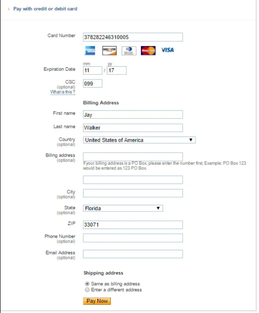
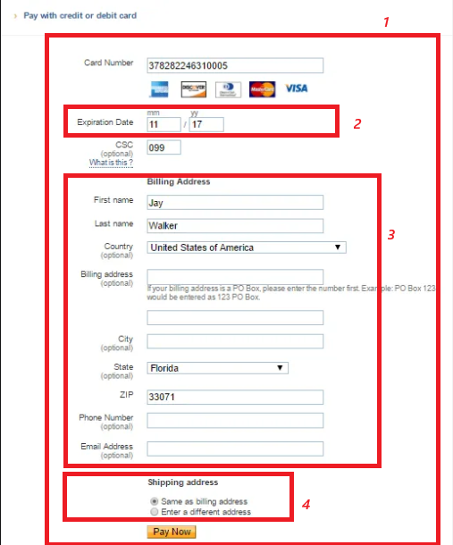
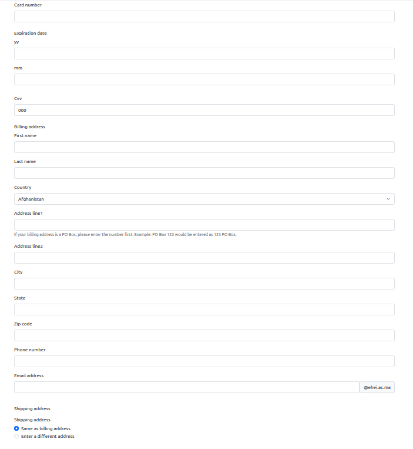
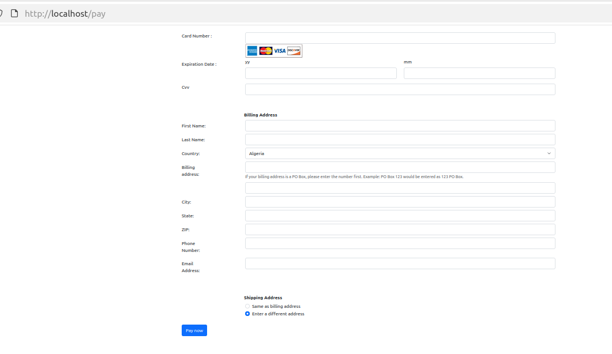

# Les formulaires en Symfony

## But de l'exercices

Le but de cet exercice est de vous familiariser avec le composant "Form" de Symfony.

## Exercice

Nous allons construire un formulaire de paiement par carte.

Une carte ressemblera à cela.



Pour cela, nous allons : 

- construire le form type dédié, 

- personnaliser le formulaire: afficher les champs comme montré dans l'image. 


### Etape 1: 

- Créer le formulaire dans `src/Form/Type/CreditCardType.php`

    Vous voyez, le formulaire contient beaucoup de champs: 

    

    (1) Le formulaire principal.

    ```php
        <?php

        declare(strict_types=1);

        namespace App\Form\Type;

        use Symfony\Component\Form\AbstractType;
        use Symfony\Component\Form\Extension\Core\Type\TextType;
        use Symfony\Component\Form\FormBuilderInterface;
        use Symfony\Component\OptionsResolver\OptionsResolver;

        class CreditCardType extends AbstractType
        {
            public function buildForm(FormBuilderInterface $builder, array $options): void
            {
                $builder->add(child: 'cardNumber', type: TextType::class)
                    ->add(child: 'expirationDate', type: ExpirationDateType::class)
                    ->add(child: 'cvv', type: TextType::class, options: [
                        'attr' => [
                            'maxlength' => 3,
                        ],
                    ])
                    ->add(child: 'billingAddress', type: BillingAddressType::class)
                    ->add(child: 'shippingAddress', type: ShippingAddressType::class);
            }

            public function configureOptions(OptionsResolver $resolver): void
            {
            }
        }

    ```

    (2) Un FormType qui représentera la date d'expiration (`src/Form/Type/ExpirationDateType`) et qui se composera de 2 champs (Année / Mois).

    ```php
        <?php

        declare(strict_types=1);

        namespace App\Form\Type;

        use Symfony\Component\Form\AbstractType;
        use Symfony\Component\Form\Extension\Core\Type\TextType;
        use Symfony\Component\Form\FormBuilderInterface;
        use Symfony\Component\OptionsResolver\OptionsResolver;

        class ExpirationDateType extends AbstractType
        {
            public function buildForm(FormBuilderInterface $builder, array $options): void
            {
                $builder
                    ->add(child: 'year', type: TextType::class, options: [
                        'label' => 'yy',
                    ])
                    ->add(child: 'month', type: TextType::class, options: [
                        'label' => 'mm',
                    ]);
            }

            public function configureOptions(OptionsResolver $resolver): void
            {
            }
        }

    ```


    (3) Un FormType qui représentera l'adresse de facturation (`src/Form/Type/ShippingAddressType`) et qui se composera de plusieurs champs.

    ```php
        <?php

        declare(strict_types=1);

        namespace App\Form\Type;

        use Symfony\Component\Form\AbstractType;
        use Symfony\Component\Form\Extension\Core\Type\CountryType;
        use Symfony\Component\Form\Extension\Core\Type\EmailType;
        use Symfony\Component\Form\Extension\Core\Type\TextType;
        use Symfony\Component\Form\FormBuilderInterface;
        use Symfony\Component\OptionsResolver\OptionsResolver;

        class BillingAddressType extends AbstractType
        {
            public function buildForm(FormBuilderInterface $builder, array $options): void
            {
                $builder
                    ->add(child: 'firstName', type: TextType::class)
                    ->add(child: 'lastName', type: TextType::class)
                    ->add(child: 'country', type: CountryType::class)
                    ->add(child: 'addressLine1', type: TextType::class, options: [
                        'required' => false,
                        'help' => 'If your billing address is a PO Box, please enter the number first. Example: PO Box 123 would be entered as 123 PO Box.',
                    ])
                    ->add(child: 'addressLine2', type: TextType::class, options: [
                        'required' => false,
                    ])
                    ->add(child: 'city', type: TextType::class)
                    ->add(child: 'state', type: TextType::class)
                    ->add(child: 'zipCode', type: TextType::class)
                    ->add(child: 'phoneNumber', type: TextType::class)
                    ->add(child: 'emailAddress', type: EmailType::class);
            }

            public function configureOptions(OptionsResolver $resolver): void
            {
            }
        }

    ```


    (4) Un FormType qui représentera l'adresse de livraison (`src/Form/Type/ShippingAddressType`).

    ```php
        <?php

        declare(strict_types=1);

        namespace App\Form\Type;

        use Symfony\Component\Form\AbstractType;
        use Symfony\Component\Form\Extension\Core\Type\ChoiceType;
        use Symfony\Component\Form\FormBuilderInterface;
        use Symfony\Component\OptionsResolver\OptionsResolver;

        class ShippingAddressType extends AbstractType
        {
            public function buildForm(FormBuilderInterface $builder, array $options): void
            {
                $builder
                    ->add(child: 'shippingAddress', type: ChoiceType::class, options: [
                        'choices' => [
                            'Same as billing address' => 'keep_same_address',
                            'Enter a different address' => 'enter_different_address',
                        ],
                        'expanded' => true,
                        'multiple' => false,
                    ]);
            }

            public function configureOptions(OptionsResolver $resolver): void
            {
            }
        }

    ```

    Vous pouvez copier/coller ces codes ou les écrire à la main afin de vous familiariser le composant Form de Symfony.


- Créer un controleur de test: `/pay` et ensuite créer le formulaire de paiement : 

    ```php
        <?php

        declare(strict_types=1);

        namespace App\Controller;

        use App\Form\Type\CreditCardType;
        use Symfony\Bundle\FrameworkBundle\Controller\AbstractController;
        use Symfony\Component\HttpFoundation\Response;
        use Symfony\Component\Routing\Attribute\Route;

        class PaymentController extends AbstractController
        {
            #[Route(name: 'app_payment', path: '/pay')]
            public function index(): Response
            {
                $form = $this->createForm(CreditCardType::class);

                return $this->render('payment/index.html.twig', [
                    'form' => $form,
                ]);
            }
        }

    ```

- Dans `templates/payment/index.html.twig`: 

    ```twig
    
    
    {{ form(form) }}
    
    ```

- Vous devez avoir : 

    


Vous remarquez que, bien qu'un simple appel à `form()` ait affiché tous les champs, nous n'avons pas la possibilité de les placer précisément à l'endroit souhaité.

Nous allons donc commencer à personnaliser ce formulaire. Avant de commencer, nous allons remplacer l'appel à `form()` par les fonctions `form_*` 

- templates/payment/index.html.twig :

    ```twig
        
        
        
            {{ form_start(form) }}
            {{ form_row(form) }}
            <button type="submit" class="btn btn-primary">
                Pay now
            </button>
            {{ form_end(form) }}
        
    ```

- templates/form/themes/payment/billing_address/custom_billing_address_theme.html.twig :

    ```twig
    
        <div class="pt-5">
            {{ form_label(form, 'Billing Address', {label_attr: {class: 'offset-md-2 fw-bolder'}}) }}
            <div class="form-group row mb-2">
                {{ form_label(form.firstName, 'First Name: ' ,{label_attr: {class: 'col-2 col-form-label'}}) }}
                <div class="col-10">
                    {{ form_widget(form.firstName) }}
                </div>
                {{ form_errors(form.firstName) }}
            </div>
            <div class="form-group row mb-2">
                {{ form_label(form.lastName, 'Last Name: ' ,{label_attr: {class: 'col-2 col-form-label'}}) }}
                <div class="col-10">
                    {{ form_widget(form.lastName) }}
                </div>
                {{ form_errors(form.lastName) }}
            </div>
            <div class="form-group row mb-2">
                <div class="col-2">
                    {{ form_label(form.country, 'Country: ' ,{label_attr: {class: 'col-2 col-form-label'}}) }}
                </div>
                <div class="col-10">
                    {{ form_widget(form.country) }}
                </div>
                {{ form_errors(form.country) }}
            </div>
            <div class="form-group row mb-2">
                <div class="col-2">
                    {{ form_label(form.addressLine1, 'Billing address: ' ,{label_attr: {class: 'col-2 col-form-label'}}) }}
                </div>
                <div class="col-10">
                    {{ form_widget(form.addressLine1) }}
                    {{ form_help(form.addressLine1) }}
                </div>

                {{ form_errors(form.addressLine1) }}
            </div>
            <div class="form-group row mb-2">
                <div class="col-2">
                    {{ form_label(form.addressLine2) }}
                </div>
                <div class="col-10">
                    {{ form_widget(form.addressLine2) }}
                </div>
                {{ form_errors(form.addressLine2) }}
            </div>
            <div class="form-group row mb-2">
                <div class="col-2">
                    {{ form_label(form.city, 'City: ' ,{label_attr: {class: 'col-2 col-form-label'}}) }}
                </div>
                <div class="col-10">
                    {{ form_widget(form.city) }}
                </div>
                {{ form_errors(form.city) }}
            </div>
            <div class="form-group row mb-2">
                <div class="col-2">
                    {{ form_label(form.state, 'State: ' ,{label_attr: {class: 'col-2 col-form-label'}}) }}
                </div>
                <div class="col-10">
                    {{ form_widget(form.state) }}
                </div>
                {{ form_errors(form.state) }}
            </div>
            <div class="form-group row mb-2">
                <div class="col-2">
                    {{ form_label(form.zipCode, 'ZIP: ' ,{label_attr: {class: 'col-2 col-form-label'}}) }}
                </div>
                <div class="col-10">
                    {{ form_widget(form.zipCode) }}
                </div>
                {{ form_errors(form.zipCode) }}
            </div>
            <div class="form-group row mb-2">
                <div class="col-2">
                    {{ form_label(form.phoneNumber, 'Phone Number: ' ,{label_attr: {class: 'col-2 col-form-label'}}) }}
                </div>
                <div class="col-10">
                    {{ form_widget(form.phoneNumber) }}
                </div>
                {{ form_errors(form.phoneNumber) }}
            </div>
            <div class="form-group row mb-2">
                <div class="col-2">
                    {{ form_label(form.emailAddress, 'Email Address: ' ,{label_attr: {class: 'col-2 col-form-label'}}) }}
                </div>
                <div class="col-10">
                    {{ form_widget(form.emailAddress) }}
                </div>
                {{ form_errors(form.emailAddress) }}
            </div>
        </div>
    

    
        <label {{ block('label_attributes') }}>{{ label }}</label>
    

    ```

- templates/form/themes/payment/shipping_address/custom_shipping_address.html.twig

    ```twig
        
            <div class="pt-5">
                {{ form_label(form, 'Shipping Address', {label_attr: {class: 'offset-md-2 fw-bolder'}}) }}
            </div>
            <div class="form-group row mb-2">
                {{ form_label(form.shippingAddress, ' ' ,{label_attr: {class: 'col-2 col-form-label'}}) }}
                <div class="col-10">
                    {{ form_widget(form.shippingAddress) }}
                </div>
                {{ form_errors(form.shippingAddress) }}
            </div>
        

    ```

- templates/form/themes/payment/custom_theme.html.twig

    ```twig
        
            <div class="row">
                <div class="col-2">
                    {{ form_label(form) }}
                </div>
                <div class="col-10">
                    <div class="row">
                        <div class="col-6">
                            {{ form_row(form.year) }}
                        </div>
                        <div class="col-6">
                            {{ form_row(form.month) }}
                        </div>
                    </div>
                </div>
            </div>
            {{ form_errors(form) }}
        

        
            <div class="row">
                <div class="col-2">
                    {{ form_label(form) }}
                </div>
                <div class="col-10">
                    <div class="form-group">
                        {{ form_widget(form) }}
                    </div>
                </div>
                {{ form_errors(form) }}
            </div>
        

        
            <div class="row">
                <div class="col-2">
                    {{ form_label(form) }}
                </div>
                <div class="col-10">
                    <div class="form-group">
                        {{ form_widget(form) }}
                        
                    </div>
                </div>
                {{ form_errors(form) }}
            </div>
        

    ```

- assets/img.png

    


Maintenant que nous  avons terminé avec Twig, passant à nos Form Types: 

- src/Form/Type/BillingAddressType.php
    ```php
    <?php

    declare(strict_types=1);

    namespace App\Form\Type;

    use Symfony\Component\Form\AbstractType;
    use Symfony\Component\Form\Extension\Core\Type\CountryType;
    use Symfony\Component\Form\Extension\Core\Type\EmailType;
    use Symfony\Component\Form\Extension\Core\Type\TextType;
    use Symfony\Component\Form\FormBuilderInterface;
    use Symfony\Component\OptionsResolver\OptionsResolver;

    class BillingAddressType extends AbstractType
    {
        public function buildForm(FormBuilderInterface $builder, array $options): void
        {
            $builder
                ->add(child: 'firstName', type: TextType::class)
                ->add(child: 'lastName', type: TextType::class)
                ->add(child: 'country', type: CountryType::class)
                ->add(child: 'addressLine1', type: TextType::class, options: [
                    'required' => false,
                    'help' => 'If your billing address is a PO Box, please enter the number first. Example: PO Box 123 would be entered as 123 PO Box.',
                ])
                ->add(child: 'addressLine2', type: TextType::class, options: [
                    'required' => false,
                    'label' => false,
                ])
                ->add(child: 'city', type: TextType::class)
                ->add(child: 'state', type: TextType::class)
                ->add(child: 'zipCode', type: TextType::class)
                ->add(child: 'phoneNumber', type: TextType::class)
                ->add(child: 'emailAddress', type: EmailType::class);
        }

        public function configureOptions(OptionsResolver $resolver): void
        {
        }
    }

    ```

- src/Form/Type/CreditCardType.php

    ```php
    <?php

    declare(strict_types=1);

    namespace App\Form\Type;

    use Symfony\Component\Form\AbstractType;
    use Symfony\Component\Form\Extension\Core\Type\TextType;
    use Symfony\Component\Form\FormBuilderInterface;
    use Symfony\Component\OptionsResolver\OptionsResolver;

    class CreditCardType extends AbstractType
    {
        public function buildForm(FormBuilderInterface $builder, array $options): void
        {
            $builder
                ->add(child: 'cardNumber', type: TextType::class, options: [
                    'label' => 'Card Number :',
                ])
                ->add(child: 'expirationDate', type: ExpirationDateType::class, options: [
                    'label' => 'Expiration Date :',
                ])
                ->add(child: 'cvv', type: TextType::class, options: [
                    'attr' => [
                        'maxlength' => 3,
                    ],
                ])
                ->add(child: 'billingAddress', type: BillingAddressType::class)
                ->add(child: 'shippingAddress', type: ShippingAddressType::class);
        }

        public function configureOptions(OptionsResolver $resolver): void
        {
            $resolver->setDefaults(defaults: [
                'label' => false,
                'enable_csrf' => true,
                'csrf_token_id' => '__pay',
                'csrf_token_parameter' => '_pay_token',
            ]);
        }
    }

    ```

- src/Form/Type/ExpirationDateType.php

    ```php
    <?php

    declare(strict_types=1);

    namespace App\Form\Type;

    use Symfony\Component\Form\AbstractType;
    use Symfony\Component\Form\Extension\Core\Type\TextType;
    use Symfony\Component\Form\FormBuilderInterface;
    use Symfony\Component\OptionsResolver\OptionsResolver;

    class ExpirationDateType extends AbstractType
    {
        public function buildForm(FormBuilderInterface $builder, array $options): void
        {
            $builder
                ->add(child: 'year', type: TextType::class, options: [
                    'label' => 'yy',
                ])
                ->add(child: 'month', type: TextType::class, options: [
                    'label' => 'mm',
                ]);
        }

        public function configureOptions(OptionsResolver $resolver): void
        {
        }
    }

    ```

- src/Form/Type/ShippingAddressType.php

    ```php
    <?php

    declare(strict_types=1);

    namespace App\Form\Type;

    use Symfony\Component\Form\AbstractType;
    use Symfony\Component\Form\Extension\Core\Type\ChoiceType;
    use Symfony\Component\Form\FormBuilderInterface;
    use Symfony\Component\OptionsResolver\OptionsResolver;

    class ShippingAddressType extends AbstractType
    {
        public function buildForm(FormBuilderInterface $builder, array $options): void
        {
            $builder
                ->add(child: 'shippingAddress', type: ChoiceType::class, options: [
                    'choices' => [
                        'Same as billing address' => 'keep_same_address',
                        'Enter a different address' => 'enter_different_address',
                    ],
                    'expanded' => true,
                    'multiple' => false,
                ]);
        }

        public function configureOptions(OptionsResolver $resolver): void
        {
        }
    }

    ```

Enfin, créons un controleur pour afficher et tester l'affichage de notre formulaire 

- src/Controller/PaymentController.php

    ```php
    <?php

    declare(strict_types=1);

    namespace App\Controller;

    use App\Form\Type\CreditCardType;
    use Symfony\Bundle\FrameworkBundle\Controller\AbstractController;
    use Symfony\Component\HttpFoundation\Response;
    use Symfony\Component\Routing\Attribute\Route;

    class PaymentController extends AbstractController
    {
        #[Route(name: 'app_payment', path: '/pay')]
        public function index(): Response
        {
            $form = $this->createForm(CreditCardType::class);

            return $this->render('payment/index.html.twig', [
                'form' => $form,
            ]);
        }
    }

    ```


## Resultat final : 

vous devez avoir le resultat suivant : 




## Références :

- [https://symfony.com/doc/current/form/form_customization.html](https://symfony.com/doc/current/form/form_customization.html)

- [https://symfony.com/doc/current/form/form_themes.html](https://symfony.com/doc/current/form/form_themes.html)

- [https://symfony.com/doc/current/reference/forms/types.html](https://symfony.com/doc/current/reference/forms/types.html)