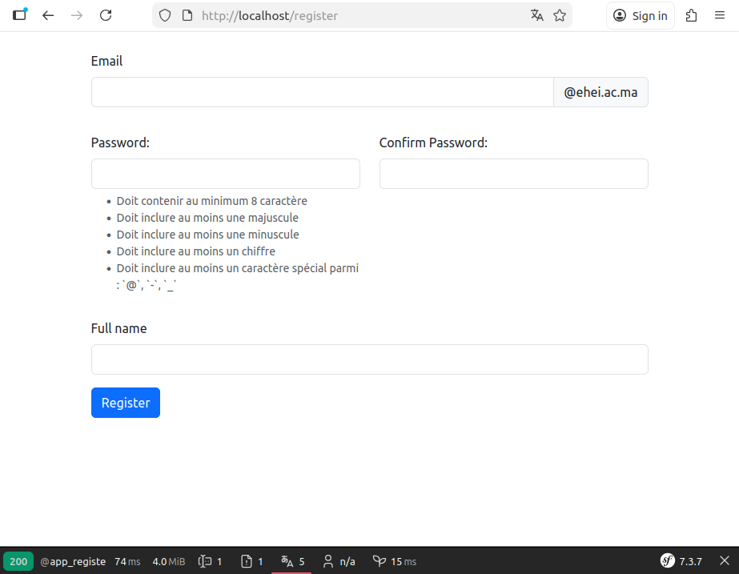
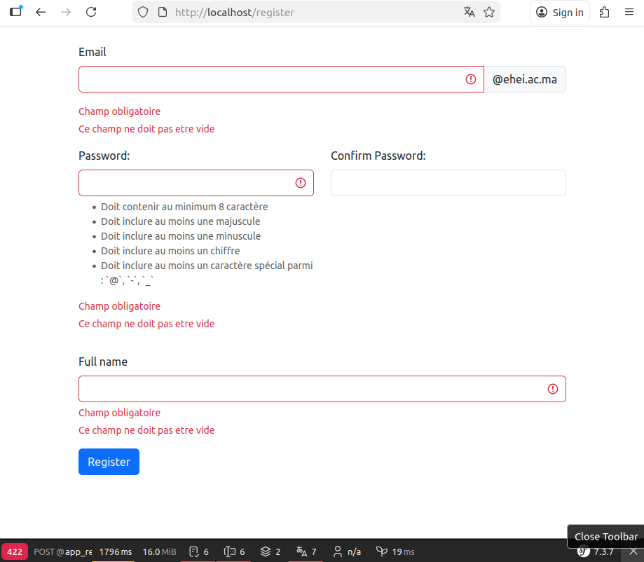
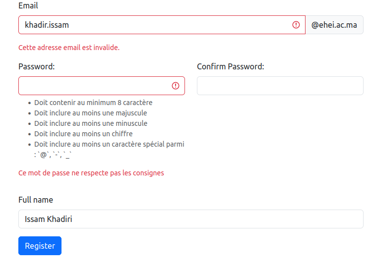
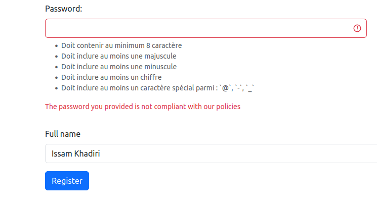
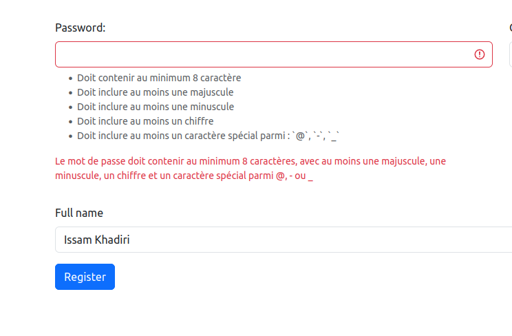

# Validation des données sous Symfony 

## But de l'exercice 

Le but de cet exercice est de créer un formulaire d'inscription. Ce formulaire va contenir :

- Champ email 

- Champ nom complet

- Mot de passe : Le mot de passe doit respecter les consignes suivantes: 

    - Doit contenir au minimum 8 caractères
    - Doit inclure au moins une majuscule
    - Doit inclure au moins une minuscule
    - Doit inclure au moins un chiffre
    - Doit inclure au moins un caractère spécial parmi : `@`, `-`, `_`

- Confirmer le mot de passe


## Créer le formulaire d'inscription 

- Créer votre formulaire:  `src/Form/Type/RegisterType.php` 

    ```php
    <?php

    namespace App\Form\Type;

    use App\DTO\RegistrationRequest;
    use Symfony\Component\Form\AbstractType;
    use Symfony\Component\Form\Extension\Core\Type\EmailType;
    use Symfony\Component\Form\Extension\Core\Type\PasswordType;
    use Symfony\Component\Form\Extension\Core\Type\RepeatedType;
    use Symfony\Component\Form\Extension\Core\Type\TextType;
    use Symfony\Component\Form\FormBuilderInterface;
    use Symfony\Component\OptionsResolver\OptionsResolver;

    class RegisterType extends AbstractType
    {
        public function buildForm(FormBuilderInterface $builder, array $options): void
        {
            $builder->add(child: 'email', type: EmailType::class)
                ->add(child: 'fullName', type: TextType::class)
                ->add(child: 'password', type: RepeatedType::class, options: [
                    'type' => PasswordType::class,
                    'first_options' => [
                        'help_html' => true,
                        'help' => '<ul>
        <li>Doit contenir au minimum 8 caractère</li>
        <li>Doit inclure au moins une majuscule</li>
        <li>Doit inclure au moins une minuscule</li>
        <li>Doit inclure au moins un chiffre</li>
        <li>Doit inclure au moins un caractère spécial parmi : `@`, `-`, `_`</li>
    </ul>'
                    ]
                ]);
        }

        public function configureOptions(OptionsResolver $resolver): void
        {
            $resolver->setDefaults([
                'data_class' => RegistrationRequest::class,
                'attr' => [
                    'novalidate' => true,
                ],
            ]);
        }
    }

    ```

    `Symfony\Component\Form\Extension\Core\Type\RepeatedType;` est utilisé pour définir un champ qui nécessite une confirmation.

    l'option `novalidate` pour désactiver la validation `html5` coté front.

- Créer la template twig `templates/register/index.html.twig` pour afficher le formulaire. Nous allons essayer d'afficher le formulaire comme ceci : 

    

    pour cela, assurez vous d'avoir la configuration suivante dans `config/packages/twig.yaml` 

    ```twig
    twig:
        file_name_pattern: '*.twig'
        form_themes:
            - 'bootstrap_5_layout.html.twig'
    
    ```

    Le code suivant contient: 

    ➡ L'affiche du formulaire  
    ➡ Personnaliser le formulaire

    ```twig

    
    

    
        {{ form_start(registerForm) }}
        <div class="mb-3">
            {{ form_row(registerForm.email) }}
        </div>
        <div class="mb-3">
            {{ form_row(registerForm.password) }}
        </div>
        <div class="mb-3">
            {{ form_row(registerForm.fullName) }}
        </div>
        <button type="submit" class="btn btn-primary">Register</button>
        {{ form_end(registerForm) }}
    

    
        <div class="row">
            <div class="col-6">
                {{ form_row(form.first, {label: 'Password: '}) }}
            </div>
            <div class="col-6">
                {{ form_row(form.second, {label: 'Confirm Password: '}) }}
            </div>
        </div>
    

    
        <div class="row">
            <div class="col-12">
                {{ form_label(form) }}
                <div class="input-group mb-3">
                    {{ form_widget(form) }}
                    <span class="input-group-text" id="basic-addon2">@ehei.ac.ma</span>
                </div>
                {{ form_errors(form) }}
            </div>
        </div>
    

    ```


- Comme vu dans le cours, il est toujours préférable d'utiliser les DTO pour harmoniser le code et le rendre lisible et maintenable. Dans ce but, nous allons créer le DTO `

    ```php
    <?php

    namespace App\DTO;

    use App\Validator\Constraints\RequiredField;
    use Symfony\Component\Validator\Constraints as Assert;

    class RegistrationRequest
    {
        #[Assert\Email(message: 'Cette adresse email est invalide.')]
        #[Assert\NotNull(message: 'Champ obligatoire')]
        #[Assert\NotBlank(message: 'Ce champ ne doit pas etre vide')]
        private ?string $email;

        #[Assert\NotNull(message: 'Champ obligatoire')]
        #[Assert\NotBlank(message: 'Ce champ ne doit pas etre vide')]
        #[Assert\Regex(message: 'Ce mot de passe ne respecte pas les consignes', pattern: '/^(?=.*[A-Z])(?=.*[a-z])(?=.*\d)(?=.*[@\-_]).{8,}$/')]
        private ?string $password;

        #[Assert\NotNull(message: 'Champ obligatoire')]
        #[Assert\NotBlank(message: 'Ce champ ne doit pas etre vide')]
        private ?string $fullName;

        public function getEmail(): ?string
        {
            return $this->email;
        }

        public function setEmail(?string $email): void
        {
            $this->email = $email;
        }

        public function getFullName(): ?string
        {
            return $this->fullName;
        }

        public function setFullName(?string $fullName): void
        {
            $this->fullName = $fullName;
        }

        public function getPassword(): ?string
        {
            return $this->password;
        }

        public function setPassword(?string $password): void
        {
            $this->password = $password;
        }
    }


    ```

    pour la validation du mot de passe selon les containtes déclarées plus haut, voici la regex à utiliser `^(?=.*[A-Z])(?=.*[a-z])(?=.*\d)(?=.*[@\-_]).{8,}$` 

    les contraintes `NotBlank` et `NotNull` pour assurer que les champs sont obligatoires.

    vous remarquez que tous les champs sont nullables: c'est important. En PHP, si on tape une propriété en *string*, le langage n’accepte pas *null* et l’exécution échoue avant même que Symfony n’intervienne. Pour laisser Symfony gérer la validation (par exemple avec **#[Assert\NotNull]**), il faut déclarer la propriété en ?string. Ainsi, PHP autorise *null*, et c’est ensuite le *Validator* de Symfony qui décide si la valeur est valide ou non.

 
- Dans notre controleur `src/Controller/RegisterController.php`

    ```php
    <?php

    declare(strict_types=1);

    namespace App\Controller;

    use App\DTO\RegistrationRequest;
    use App\Form\Type\RegisterType;
    use Symfony\Bundle\FrameworkBundle\Controller\AbstractController;
    use Symfony\Component\HttpFoundation\Request;
    use Symfony\Component\HttpFoundation\Response;
    use Symfony\Component\Routing\Attribute\Route;

    class RegisterController extends AbstractController
    {
        #[Route('/register')]
        public function index(Request $req): Response
        {
            $registrationDTO = new RegistrationRequest();

            $register = $this->createForm(type: RegisterType::class, data: $registrationDTO);

            $register->handleRequest($req);

            if ($register->isSubmitted() && $register->isValid()) {
                // send registration email for confirmation
                dd(
                    $register->getData(),
                    $registrationDTO,
                    $register->getData() === $registrationDTO
                );
            }

            return $this->render('register/index.html.twig', [
                'registerForm' => $register,
            ]);
        }
    }

    ```

- Vous devez avoir ce resultat si vous essayez d'envoyer le formulaire avec des données invalides

    

    

    Note : ici c'est normal ce comportement car `khadiri.issam` n'est pas un email valide. Vous pouvez changer `EmailType` par `TextType`

### Eviter la répetition : 

Vous remarquez que les 2 contraintes `NotNull` et `NotBlank` sont utilisées partout. Comme ce sont des contraintes que nous utilisons souvent ensemble, nous pouvons les regrouper avec `Compound`.

Pour cela:

- créer une contrainte `src/Validator/Constraints/RequiredField.php` :

    ```php
    <?php

    namespace App\Validator\Constraints;

    use Symfony\Component\Validator\Constraints\Compound;
    use Symfony\Component\Validator\Constraints as Assert;

    #[\Attribute]
    class RequiredField extends Compound
    {
        protected function getConstraints(array $options): array
        {
            return [
                new Assert\NotNull(message: 'Champ obligatoire'),
                new Assert\NotBlank(message: 'Ce champ ne doit pas etre vide'),
            ];
        }
    }

    ```

    l'instruction `#[\Attribute]` permet de dire à PHP que cette classe peut être utilisée comment un attribut (C'est comme cela qu'on crée des attributs en PHP).

    Maintenant, il suffit de faire: 

    ```php

    use App\Validator\Constraints\RequiredField;

    class RegistrationRequest
    {
        #[Assert\Email(message: 'Cette adresse email est invalide.')]
        #[RequiredField]
        protected ?string $email;

        #[RequiredField]
        #[Assert\Regex(message: 'Ce mot de passe ne respecte pas les consignes', pattern: '/^(?=.*[A-Z])(?=.*[a-z])(?=.*\d)(?=.*[@\-_]).{8,}$/')]
        private ?string $password;

        #[RequiredField]
        private ?string $fullName;
        ...

    }

    ```


### Créer sa propre contrainte

Supposons que l’on souhaite vérifier que notre mot de passe respecte les contraintes décrites plus haut. Dans ce cas, on peut utiliser `#[Regex]`. D’ailleurs, c’est ce qu’il fallait faire : il ne faut pas réinventer la roue, il faut toujours utiliser ce que Symfony propose déjà. Mais imaginons que l’on souhaite créer une contrainte personnalisée pour valider le mot de passe. Pour cela: 

- Il faut créer **LA CONTRAINTE** :  `src/Validator/Constraints/PasswordField.php` : 

    la contrainte n'est qu'une classe qui hérite de `Symfony\Component\Validator\Constraint`


    ```php
    <?php

    namespace App\Validator\Constraints;


    use Symfony\Component\Validator\Constraint;

    #[\Attribute]
    class PasswordField extends Constraint
    {
        public string $message = 'The password you provided is not compliant with our policies';

        public function __construct(?string $message = null, mixed $options = null, ?array $groups = null, mixed $payload = null)
        {
            parent::__construct($options, $groups, $payload);

            $this->message = $message ?? $this->message;
        }
    }

    ```

- Créer le **VALIDATEUR** de la contrainte : `src/Validator/Constraints/PasswordFieldValidator.php` :


    La contrainte seule ne suffit pas : il faut créer son *validateur*. Par défaut, le validateur est une classe portant le nom de la contrainte, suffixé par Validator. Dans notre cas, il s’agit de `PasswordFieldValidator`. Vous pouvez toutefois personnaliser ce comportement en redéfinissant la méthode `validatedBy` dans *PasswordField*.

    ```php
    <?php

    namespace App\Validator\Constraints;

    use Symfony\Component\Validator\Constraint;
    use Symfony\Component\Validator\ConstraintValidator;
    use Symfony\Component\Validator\Exception\UnexpectedTypeException;
    use Symfony\Component\Validator\Exception\UnexpectedValueException;

    class PasswordFieldValidator extends  ConstraintValidator
    {
        private const PASSWORD_PATTERN = '/^(?=.*[A-Z])(?=.*[a-z])(?=.*\d)(?=.*[@\-_]).{8,}$/';

        public function validate(mixed $value, Constraint $constraint): void
        {
            if (!$constraint instanceof PasswordField) {
                throw new UnexpectedTypeException($constraint, PasswordField::class);
            }

            // if the value of $value is null or empty, just do nothing. You must use NotNull and NotBlank.
            if (null === $value || '' === $value) {
                return;
            }

            // passwords can only be strings
            if (!\is_string($value)) {
                throw new UnexpectedValueException($value, 'string');
            }

            if (\preg_match(self::PASSWORD_PATTERN, $value) === 1) { // passowrd valid
                return;
            }

            // add a constraint violation to the list
            $this->context->buildViolation($constraint->message)
                ->addViolation();
        }
    }

    ```

- Utiliser la nouvelle contrainte dans `src/DTO/RegistrationRequest.php`: 

    ```php

        use App\Validator\Constraints\PasswordField;

        class RegistrationRequest
        {

            //...

            #[PasswordField]
            //     #[PasswordField(message: "Le mot de passe doit contenir au minimum 8 caractères, avec au moins une majuscule, une minuscule, un chiffre et un caractère spécial parmi @, - ou _")]

            private ?string $password;

            // ...

        }

    ```

    

    